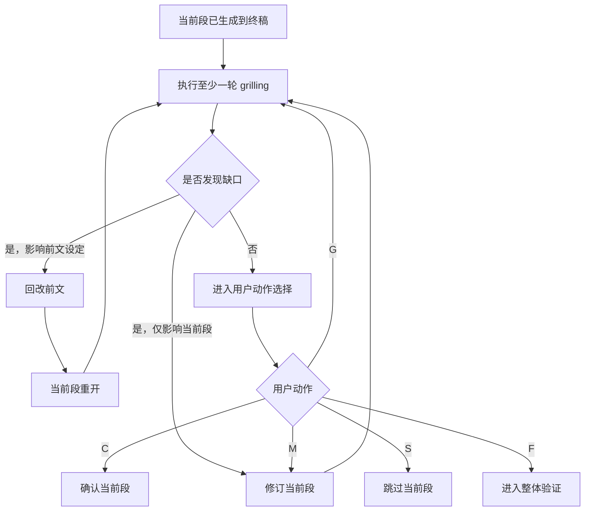
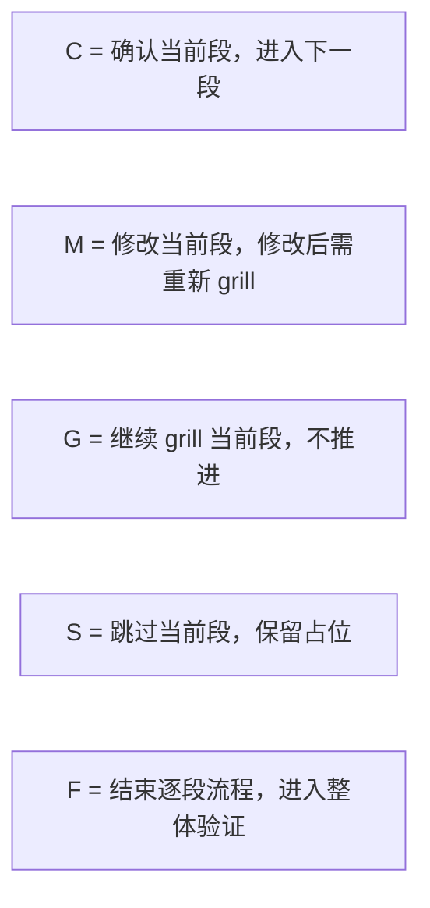

# sdx-solution 推进协议

主干：[SKILL.md](../SKILL.md)。流程：[workflow.md](workflow.md)。

## 定位

本文件定义 `sdx-solution` 的**段落推进协议**，用于约束：

- 当前段何时可推进
- 用户动作 `C/M/G/S/F` 的语义
- 前文回改后，当前段如何重开
- 何时进入整体验证

本技能默认采用**分段直写终稿**模式，不再要求先完成整份前置工作稿并做集中式收口后才允许写入。
`grilling` 的公共能力契约见 [grilling-skill.md](../../../references/grilling-skill.md)；本文只定义 `sdx-solution` 的动作协议、重开规则与用户动作绑定。

---

## 段落推进总览

---

## 段落完成条件

一个段落进入 `confirmed` 前，至少满足：

1. 已按模板生成到终稿对应位置
2. 已完成至少一轮 `grilling`
3. 若存在修订，修订后的版本已重新接受 `grilling`
4. 用户明确给出 `C`

若缺少以上任一项，不视为当前段完成。

## 当前段默认授权

进入 `grilling` 阶段后，默认授权仅用于**非语义性修订**（不改变含义的错别字/编号/排版等）。

若涉及**语义性问题**（改变目标/范围/承诺/口径/取舍/风险/MVP/里程碑/术语等），必须先给出：

- 结论（或缺口）
- 推荐修订
- 快捷数字选项

在用户明确选择前，不得修订当前段。

适用范围：

- 当前正在处理的章节或子章节
- 与当前段直接相邻、但仍属于同一当前段容器的微调

不适用范围：

- 前文章节
- 其他未打开段落
- 全文级结构重排

即：`grilling` 的默认授权只服务于当前段收口，不自动扩展到跨段修改。

## 用户动作

### C：确认

含义：

- 当前段内容已可接受
- 当前段状态切换为 `confirmed`
- 若仍有下一段，则进入下一段
- 若无下一段，则进入整体验证

### M：修改

含义：

- 用户直接指出当前段需要调整的内容
- 格式可为：`M 旧内容 - 新内容`
- 修改完成后，当前段必须重新执行至少一轮 `grilling`
- 未重新 `grilling` 前，不得直接 `C`

### G：继续 grill

含义：

- 当前段暂不推进
- 保持当前段打开状态
- 继续围绕当前段执行一轮或多轮 `grilling`
- 可连续多次使用

### S：跳过

含义：

- 当前段暂不完善
- 保留章节占位、表头或“待补充”说明
- 当前段状态记为 `skipped`
- 流程继续进入下一段或下一目标段
- 被跳过段落可在后续重新打开补写

### F：结束逐段流程

含义：

- 停止继续逐段推进
- 不要求当前文档所有段落都完成
- 直接进入整体验证与收尾检查
- 若存在 `skipped` 或未完成段，需在整体验证中显式标记

---

## 前文回改规则

当 `grilling` 发现的问题涉及前文设定错误、范围漂移、目标变化、术语冲突或依赖失真时，允许回改前面段落。

### 回改前的必做动作

涉及前文时，必须先给出：

- 受影响前提
- 推荐方案
- 快捷数字选项

在用户明确选择前，不得直接执行前文回改。

### 回改触发示例

- 当前段发现前文范围边界定义不准确
- 当前段发现业务目标与前文不一致
- 当前段发现术语定义冲突
- 当前段发现前文冲突化解策略已不足以支撑当前段

### 回改后的强制协议

一旦前文被修改：

1. 当前段状态切换为 `reopened`
2. 当前段不得直接 `C`
3. 必须基于新前提重新检查当前段
4. 必须至少再执行一轮 `grilling`
5. 再次收口后，才能接受用户确认

即：**前文回改 = 当前段重开，不等于当前段自动通过**。

---

## 重开规则

以下情况会导致当前段重开：

- 前文被修改且影响当前段成立前提
- 当前段被 `M` 修改后尚未重新 grill
- 用户显式要求重审当前段
- 当前段原本 `skipped`，后续重新补写

### 重开后的限制

- 当前段不能沿用旧的 `confirmed`
- 旧结论仅可作为参考，不可直接复用为通过状态
- 重开后必须重新完成“生成/修订 -> grill -> 用户动作”闭环

---

## 跳过与补写

`S` 不是删除段落，而是**延后完善**。
被跳过段落应满足以下最低要求之一：

- 保留章节标题与表头
- 标注“待补充”
- 标注“不适用”及理由

禁止把跳过段落留成无说明空白。

---

## 提前结束与整体验证

用户使用 `F` 后，立即停止逐段循环，转入整体验证。

### 整体验证至少检查

- 是否仍存在 `skipped` 段
- 是否存在未解释的跨段矛盾
- 编号是否连续
- 术语是否一致
- 文首 frontmatter 是否完整
- 文档是否仍保持业务可读

若验证发现重大问题，可重新打开对应段落继续走本协议。

---

## 状态映射

| 状态 | 含义 | 进入方式 | 离开方式 |
| --- | --- | --- | --- |
| `draft` | 当前段初稿已写入终稿 | 生成当前段 | 进入 `grilled` |
| `grilled` | 已完成至少一轮 grilling | 完成 grill | `C/M/G/S/F` |
| `revised` | 当前段刚被修改 | `M` 或本段修订 | 重新 grill |
| `reopened` | 因前文回改或重审重新打开 | 前文变更 / 显式重开 | 重新生成或修订后 grill |
| `confirmed` | 当前段已确认 | `C` | 被后续回改影响时可重开 |
| `skipped` | 当前段暂缓完善 | `S` | 后续补写时重开 |

---

## 协议特征

| 集中式收口 | 当前协议 |
| --- | --- |
| 先攒整篇，再统一放行 | 当前段生成后立即进入收口循环 |
| 写入前依赖单次集中确认 | 由 `C/M/G/S/F` 持续驱动推进 |
| 状态主要挂在整篇文档 | 状态主要挂在当前段 |
| 常以整篇为最小工作单位 | 以单段为最小工作单位 |
