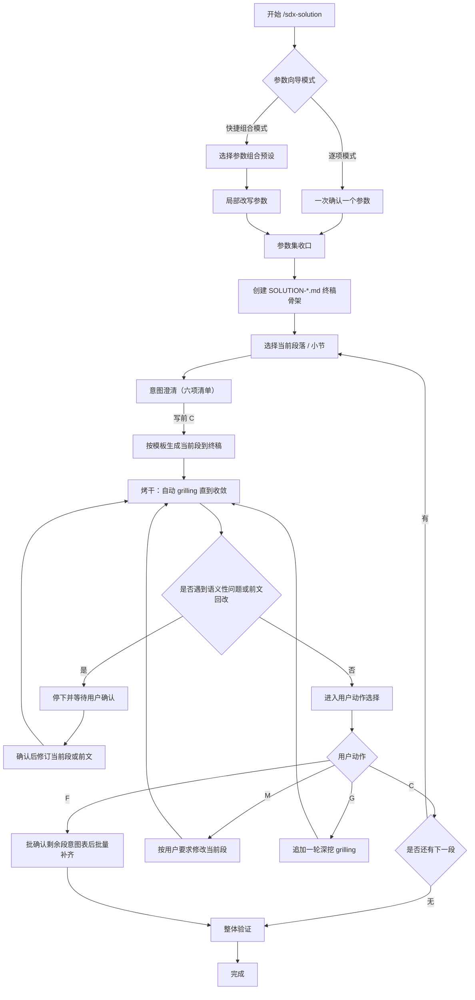
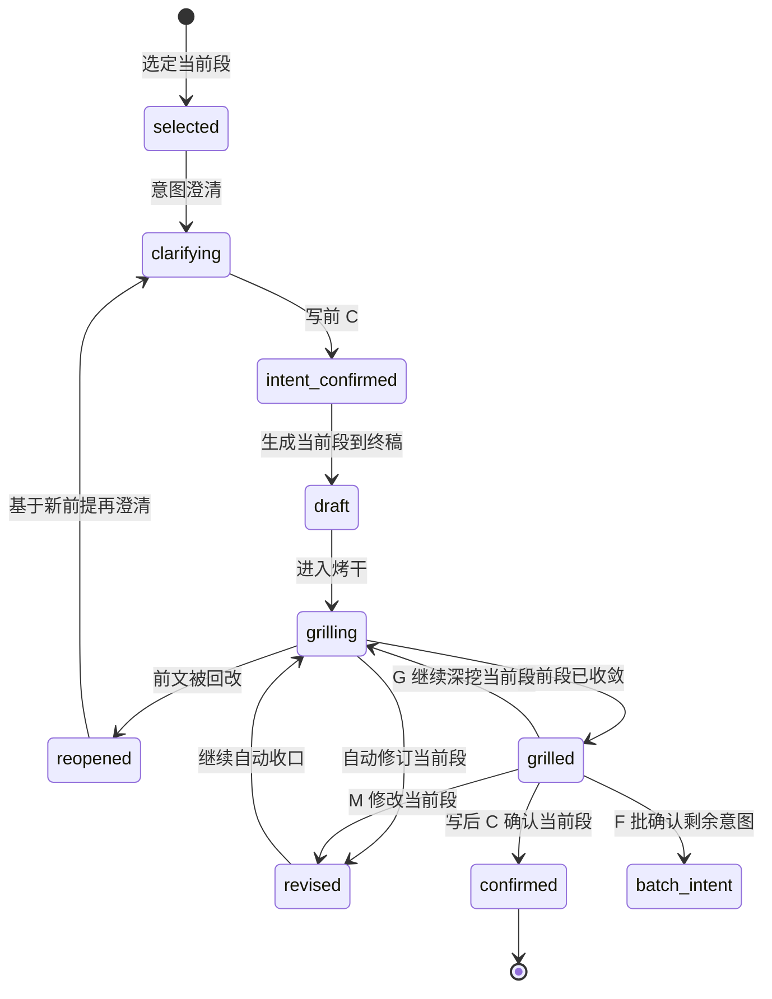

# sdx-solution 工作流

主干：[SKILL.md](../SKILL.md)。推进协议：[gates.md](gates.md)。

## 目标

通过**参数向导 + 分段「澄清 → 生成 → 烤干」**，逐步形成可评审的 `SOLUTION-{IDEA-ID}.md`。
本技能默认采用**单段收敛**的工作方式，而不是先准备整份前置草稿、再一次性集中收口。

契约分工：

- 写前**意图澄清**：[intent-clarify.md](../../../references/intent-clarify.md)
- 写后**烤干** `grilling`：[grilling-skill.md](../../../references/grilling-skill.md)

本文只定义二者在 `sdx-solution` Section Cycle 中的绑定。

**公司库**（`KNOWLEDGE_TYPE=company`）：输入含 [`company/knowledge/`](../../../../company/knowledge/README.md) 五视角；方案须明确跨系统需求下**各系统负责的功能边界**；交付物落在 `company/solutions/`，下游 `company/analysis/` 衔接各 `system/` 侧 requirements。

---

## 总流程

---

## 阶段一：参数向导

### 模式

1. **逐项模式**：一次只确认一个参数。
2. **快捷组合模式**：先选预设参数组合，再按需改单项。

---

### 最小可写条件

满足以下条件即可创建终稿骨架：

- 主题已明确，或可从材料中归纳出标题
- `IDEA-ID` 已给出或可按规则生成
- `{DOC_DIR}/solutions/` 可写
- 至少能确定本轮起始章节或默认从 `§1` 开始

### 推荐参数顺序

1. `IDEA-ID`
2. 标题 / 主题
3. `depth`：`quick | standard | deep`
4. 本轮起始章节 / 范围
5. 表达粒度与语言风格

---

### 快捷组合

快捷组合用于减少重复确认，允许如下一次性输入：

- `标准全篇`：`depth=standard`，从 `§1` 开始，默认完整七章
- `快速补段`：`depth=quick`，只处理用户指定章节
- `深度评审`：`depth=deep`，强化影响、冲突、风险与里程碑

用户选定组合后，仍可局部修改任一参数。
参数未收口时，继续留在参数向导逐项澄清，不引入额外协同机制名。

---

## 阶段二：终稿骨架初始化

参数达到最小可写条件后，立即创建：

- `{DOC_DIR}/solutions/SOLUTION-{IDEA-ID}.md`

初始化内容包括：

- 文档标题
- 七章标题与必要表头
- 文首 frontmatter 元数据占位
- 当前未写章节可保留占位说明

---

此阶段目标是建立**可持续增量写入**的终稿容器，而非等待整篇草稿成熟后再落盘。
骨架创建**不**替代各章写入前的意图澄清。

## 阶段三：Section Cycle（澄清 → 生成 → 烤干）

### 基本单位

一次只处理一个章节或子章节。
默认顺序按模板推进，也可由用户指定跳转到任意段。

### 写后默认表

`sdx-solution`：**各章节默认必须烤干**（与意图澄清契约一致；启发式只可升级、不可降级跳过）。

### 固定循环

1. 选定当前段
2. **意图澄清**：输出公共六项清单，标明「当前阶段：意图澄清」；有缺口则一问一答；用户写前 `C` 后方可写入
3. 按模板生成当前段，直接写入终稿对应位置
4. 若当前段存在 `>=2` 条真实业务路径，先在当前段内完成方案比选
5. **烤干**：对当前段执行自动 `grilling`，直到收敛；标明「当前阶段：烤干」
6. 若打出语义性问题或前文回改，暂停等待用户确认
7. 当前段收敛后，用户用 `C/M/G/F` 做写后动作选择（「当前阶段：烤干」横幅下 `C` = 确认本段）
8. 收口后再进入下一段，或在用户选 `F` 后先批确认剩余意图再批量补齐

### 约束

- 未完成写前意图澄清（无写前 `C`），不得写入当前段正文
- `grilling` 默认只拷当前段，不跨多段发散
- 若环境未安装 `grilling` Skill，则按 [grilling-skill.md](../../../references/grilling-skill.md) 的 fallback 协议执行
- 进入 `grilling` 阶段，默认授权仅用于**非语义性修订**（不改变含义的错别字、编号、排版等）
- `grilling` 打出**语义性问题**时，必须先输出结论、推荐修订与数字选项并等待用户确认；未获确认不得修订当前段
- 自动 `grilling` 收敛前，不默认推进到下一段
- `G` 不是每轮必选动作，只在自动收敛后由用户手动追加深挖
- 若本段依赖前文结论，则前文变更会触发本段重开（重开后须再意图澄清）

---

## 前文回改规则

若当前段 `grilling` 打出的问题仅影响当前段，则只修当前段。
若问题涉及前文设定错误、范围漂移、术语冲突、目标变化等，则允许回改前面段落。

### 回改后的强制动作

一旦前文被改，当前段必须：

1. 重新读取受影响前提
2. 状态 `reopened`，回到**意图澄清**
3. 写前 `C` 后重写或修订当前段
4. 重新进入自动 `grilling`
5. 再进入用户确认或批量补齐

也就是说，**前文回改不会直接视为当前段已通过**。

### 回改授权边界

- `grilling` 可直接识别“需要回改前文”，但不得把前文回改视为当前段默认授权的一部分
- 涉及前文时，先输出受影响前提、推荐方案与数字选项，再等待用户选择
- 只有用户明确选择后，才执行前文回改
- 前文一旦被改，当前段立即 `reopened`，并按本流程重新澄清与烤干

---

## 段落状态

状态含义：

- `clarifying`：写前意图澄清中，尚未写入
- `intent_confirmed`：写前 `C` 已过，即将/正在生成
- `draft`：当前段已写入终稿，但仍是初稿
- `grilling`：当前段处于烤干中
- `revised`：当前段刚被自动或人工修改，待继续收口
- `reopened`：因前文改动，当前段重新打开
- `grilled`：当前段已烤干收敛，可等待写后用户动作
- `confirmed`：用户写后确认通过

---

## 阶段四：批量补齐与整体验证

当全部目标段落已完成，或用户选择 `F` 进入全部生成时，进入收尾阶段。

### `F` 的执行方式

- 保留已确认或已收敛的前文
- **先**汇总剩余未完成章节的意图表（公共六项摘要），用户一次写前语境 `C` 确认
- 确认后再从当前段之后连续生成剩余章节（段间不再单独停意图澄清）
- 每个剩余章节写入后都要自动 `grilling` 到收敛
- 中途若遇到语义性问题或前文回改，立即停下等待用户确认；回改后受影响段须再澄清

### 验证目标

- 章节完整性
- 术语一致性
- 编号连续性（`G-n` / `C-n` / `R-n` / `MVP-n`）
- 跨段无未解释矛盾
- 文首 frontmatter 完整
- 正文保持业务可读，不混入实现级细节

### 质量基线

终检对齐 [quality-checklist.md](quality-checklist.md)。
