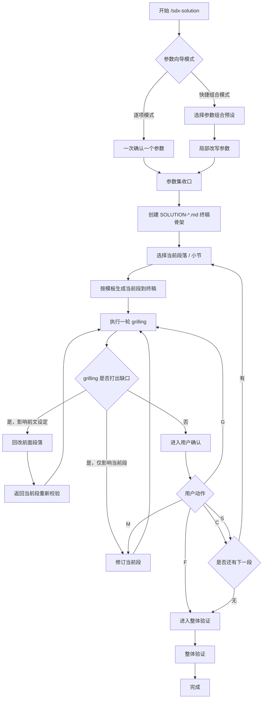
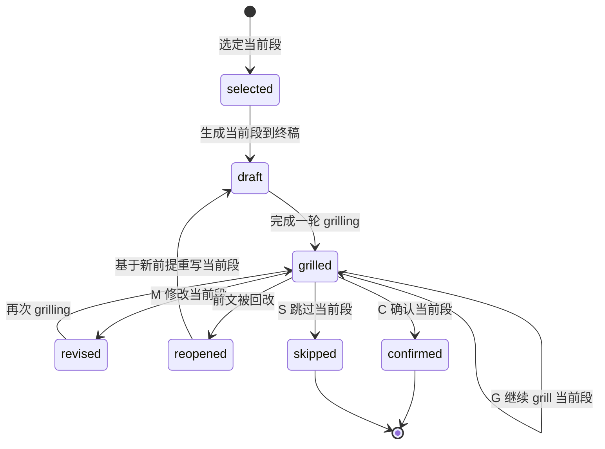

# sdx-solution 工作流

主干：[SKILL.md](../SKILL.md)。推进协议：[gates.md](gates.md)。

## 目标

通过**参数向导 + 分段直写终稿 + 段内 grilling 补强**的方式，逐步形成可评审的 `SOLUTION-{IDEA-ID}.md`。
本技能默认采用**单段收敛**的工作方式，而不是先准备整份前置草稿、再一次性集中收口。

**公司库**（`KNOWLEDGE_TYPE=company`）：输入含 [`company/knowledge/`](../../../../company/knowledge/README.md) 五视角；方案须明确跨系统需求下**各系统负责的功能边界**；交付物落在 `company/solutions/`，下游 `company/analysis/` 衔接各 `system/` 侧 requirements。

---

## 总流程

---

## 阶段一：参数向导

### 模式

1. **逐项模式**：一次只确认一个参数。
2. **快捷组合模式**：先选预设参数组合，再按需改单项。

---

### 最小可写条件

满足以下条件即可创建终稿骨架：

- 主题已明确，或可从材料中归纳出标题
- `IDEA-ID` 已给出或可按规则生成
- `{DOC_DIR}/solutions/` 可写
- 至少能确定本轮起始章节或默认从 `§1` 开始

### 推荐参数顺序

1. `IDEA-ID`
2. 标题 / 主题
3. `depth`：`quick | standard | deep`
4. 本轮起始章节 / 范围
5. 表达粒度与语言风格

---

### 快捷组合

快捷组合用于减少重复确认，允许如下一次性输入：

- `标准全篇`：`depth=standard`，从 `§1` 开始，默认完整七章
- `快速补段`：`depth=quick`，只处理用户指定章节
- `深度评审`：`depth=deep`，强化影响、冲突、风险与里程碑

用户选定组合后，仍可局部修改任一参数。

---

## 阶段二：终稿骨架初始化

参数达到最小可写条件后，立即创建：

- `{DOC_DIR}/solutions/SOLUTION-{IDEA-ID}.md`

初始化内容包括：

- 文档标题
- 七章标题与必要表头
- 文首 frontmatter 元数据占位
- 当前未写章节可保留占位说明

---

此阶段目标是建立**可持续增量写入**的终稿容器，而非等待整篇草稿成熟后再落盘。

## 阶段三：Section Cycle

### 基本单位

一次只处理一个章节或子章节。
默认顺序按模板推进，也可由用户指定跳转到任意段。

### 固定循环

1. 选定当前段
2. 按模板生成当前段
3. 直接写入终稿对应位置
4. 对当前段执行一轮 `grilling`
5. 根据拷问结果修订当前段
6. 用户用 `C/M/G/S/F` 做动作选择
7. 收口后再进入下一段

### 约束

- `grilling` 默认只拷当前段，不跨多段发散
- 当前段未收口，不默认推进到下一段
- 若本段依赖前文结论，则前文变更会触发本段重开

---

## 前文回改规则

若当前段 `grilling` 打出的问题仅影响当前段，则只修当前段。
若问题涉及前文设定错误、范围漂移、术语冲突、目标变化等，则允许回改前面段落。

### 回改后的强制动作

一旦前文被改，当前段必须：

1. 重新读取受影响前提
2. 回到当前段
3. 再执行至少一轮 `grilling`
4. 再进入用户确认

也就是说，**前文回改不会直接视为当前段已通过**。

---

## 段落状态

状态含义：

- `draft`：当前段已写入终稿，但仍是初稿
- `grilled`：至少完成一轮 `grilling`
- `revised`：当前段刚被修改，待重新校验
- `reopened`：因前文改动，当前段重新打开
- `confirmed`：用户确认通过
- `skipped`：用户跳过，保留占位，待后续补写

---

## 阶段四：整体验证

当全部目标段落已完成，或用户选择 `F` 提前结束逐段流程时，进入整体验证。

### 验证目标

- 章节完整性
- 术语一致性
- 编号连续性（`G-n` / `C-n` / `R-n` / `MVP-n`）
- 跨段无未解释矛盾
- 空节是否有“待补充 / 不适用”说明
- 文首 frontmatter 完整
- 正文保持业务可读，不混入实现级细节

### 质量基线

终检对齐 [quality-checklist.md](quality-checklist.md)。
