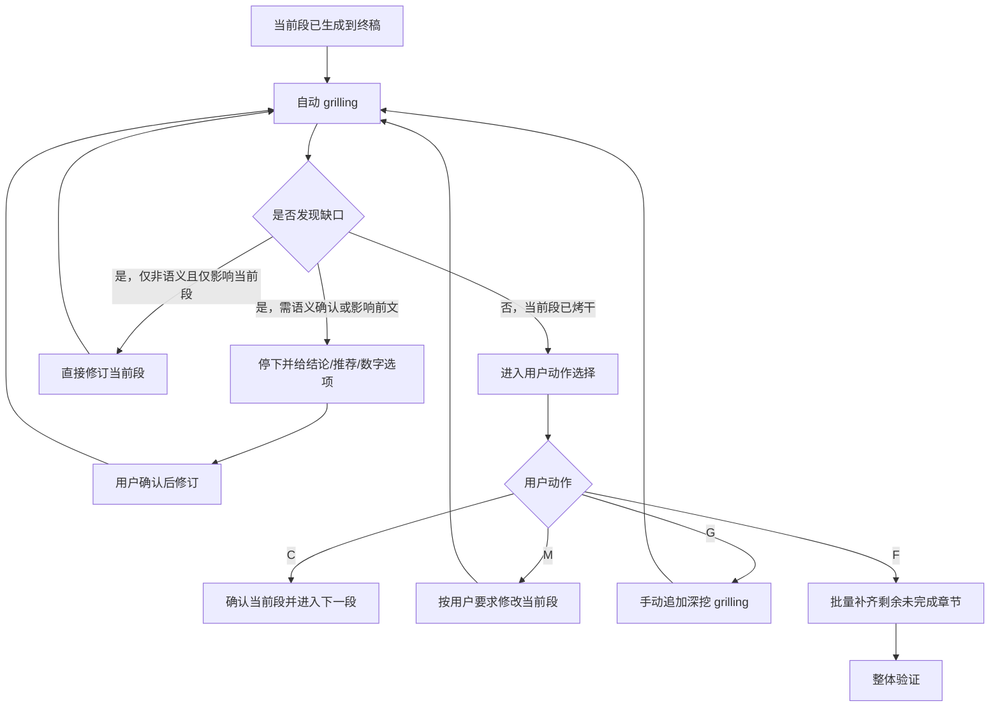
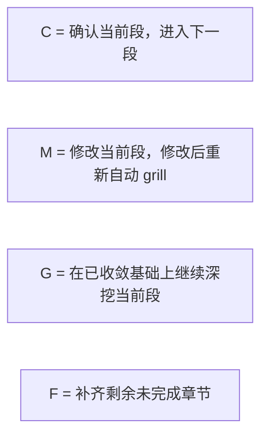

# sdx-test 推进协议

主干：[SKILL.md](../SKILL.md)。流程：[workflow.md](workflow.md)。

## 定位

本文件定义 `sdx-test` 的**段落推进协议**，用于约束：

- 当前段何时可推进
- 自动 `grilling` 如何持续收口到“烤干”
- 用户动作 `C/M/G/F` 的语义
- 前文回改后，当前段如何重开
- `F` 如何批量补齐剩余章节

本技能默认采用**分段直写终稿**模式，
参数收口后即可进入当前段写作。
`grilling` 的公共能力契约见
[grilling-skill.md](../../../references/grilling-skill.md)；
本文只定义 `sdx-test` 的自动收口、动作协议与批量补齐绑定。

---

## 段落推进总览

---

## 段落完成条件

一个段落进入 `confirmed` 前，至少满足：

1. 已按模板生成到终稿对应位置
2. 已进入自动 `grilling`
3. 自动 `grilling` 已收敛，或遇到必须等待用户确认的语义性问题后完成修订并再次收敛
4. 用户明确给出 `C`

## 自动 grilling 默认授权

进入 `grilling` 阶段后，默认授权仅用于**非语义性修订**（不改变含义的错别字、编号、排版、同段微调等）。

若涉及**语义性问题**（改变测试范围、优先级、回归边界、环境约束、数据准备口径、退出标准、术语等），必须先给出：

- 结论（或缺口）
- 推荐修订
- 快捷数字选项

在用户明确选择前，不得修订当前段或前文。

## 用户动作

### C：确认

- 当前段内容已可接受
- 当前段状态切换为 `confirmed`
- 若仍有下一段，则进入下一段
- 若无下一段，则进入整体验证

### M：修改

- 用户直接指出当前段需要调整的内容
- 格式可为：`M 旧内容 - 新内容`
- 修改完成后，当前段必须重新进入自动 `grilling`
- 未重新收敛前，不得直接 `C`

### G：继续 grill

- 自动 `grilling` 已收敛后，用户仍希望继续深挖当前段
- 保持当前段打开状态
- `G` 不是每轮必选项，只是人工加深按钮

### F：全部生成

- 保留已确认或已收敛的前文
- 从当前段之后开始，按模板一次性补齐剩余未完成章节
- 每个后续章节仍需执行自动 `grilling`，但**不再逐段停下等待动作选择**
- 批量补齐完成后，直接进入整体验证

### F 的边界

- `F` 不是整篇重生成
- `F` 不覆盖已确认前文
- `F` 过程中若遇到语义性问题或前文回改，必须停下等待用户确认

---

## 前文回改规则

当 `grilling` 发现的问题涉及前文设定错误、测试范围漂移、回归边界变化、环境约束变化、数据策略变化或上游追溯变化时，允许回改前面段落。

### 回改前的必做动作

涉及前文时，必须先给出：

- 受影响前提
- 推荐方案
- 快捷数字选项

在用户明确选择前，不得直接执行前文回改。

### 回改后的强制协议

一旦前文被修改：

1. 当前段状态切换为 `reopened`
2. 当前段不得直接 `C`
3. 必须基于新前提重新检查当前段
4. 必须重新进入自动 `grilling`
5. 再次收口后，才能接受用户确认或继续批量补齐

---

## 重开规则

以下情况会导致当前段重开：

- 前文被修改且影响当前段成立前提
- 当前段被 `M` 修改后尚未重新收敛
- 用户显式要求重审当前段
- `F` 批量补齐过程中，后续章节反向打穿了当前段前提

### 重开后的限制

- 当前段不能沿用旧的 `confirmed`
- 旧结论仅可作为参考，不可直接复用为通过状态
- 重开后必须重新完成“生成/修订 -> 自动 grill -> 用户动作”闭环

---

## 批量补齐与整体验证

用户使用 `F` 后，立即进入剩余章节批量补齐。

### 批量补齐至少满足

- 保留当前段之前已确认或已收敛内容
- 逐章生成剩余未完成章节
- 每章写入后执行自动 `grilling`，直到该章收敛
- 若中途触发语义性问题或前文回改，立即停下等待用户确认

### 整体验证至少检查

- 是否存在未解释的跨段矛盾
- 术语是否一致
- 文首 frontmatter 是否完整
- TDD 是否仍保持测试设计正文
- 批量补齐后的章节是否与已确认前文自洽

---

## 状态映射

| 状态 | 含义 | 进入方式 | 离开方式 |
| --- | --- | --- | --- |
| `draft` | 当前段初稿已写入终稿 | 生成当前段 | 进入 `grilling` |
| `grilling` | 当前段处于自动收口中 | 开始自动 `grilling` | 收敛、修订或暂停确认 |
| `grilled` | 当前段已自动收敛，可等待用户动作 | 自动 `grilling` 完成 | `C/M/G/F` |
| `revised` | 当前段刚被修改 | `M` 或本段修订 | 重新进入 `grilling` |
| `reopened` | 因前文回改或重审重新打开 | 前文变更 / 显式重开 | 重新生成或修订后 grill |
| `confirmed` | 当前段已确认 | `C` | 被后续回改影响时可重开 |
