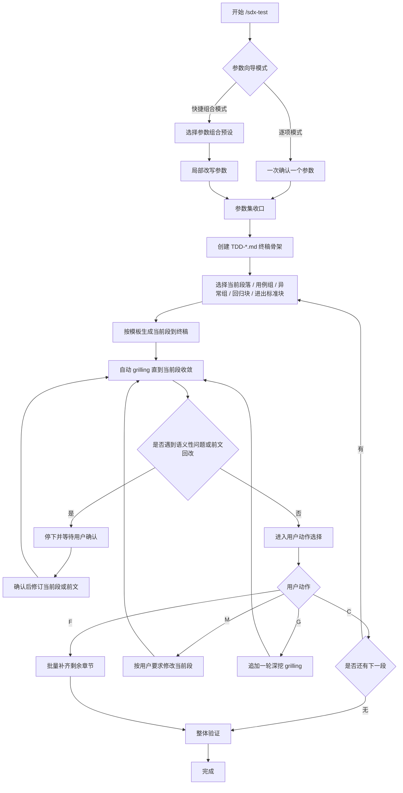
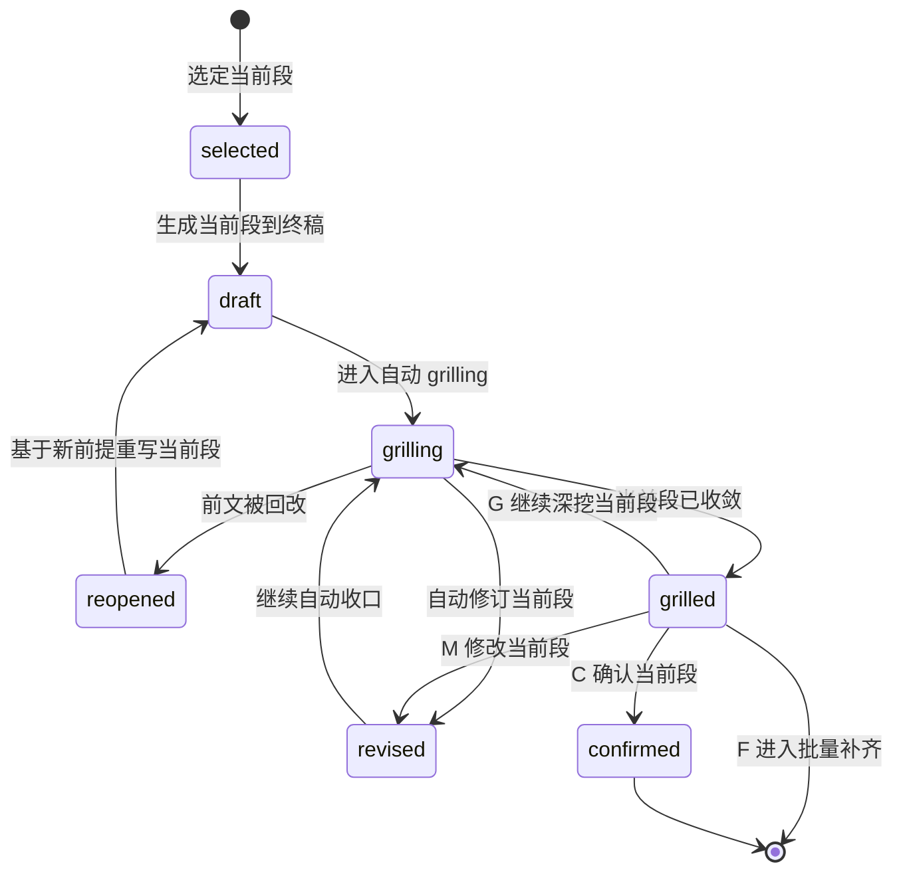

<!-- markdownlint-disable-file MD040 MD060 -->
# sdx-test 工作流

主干：[SKILL.md](../SKILL.md)。推进协议：[gates.md](gates.md)。

## 目标

通过**参数向导 + 分段直写终稿 + 自动 grilling 补强**的方式，逐步形成可评审的 `TDD-{IDEA-ID}-{N}.md`（六章）。
本技能默认采用**单段收敛**的工作方式，参数收口后直接进入当前段写作与收敛。
`grilling` 的公共能力契约见
[grilling-skill.md](../../../references/grilling-skill.md)；
本文只定义其在 `sdx-test` Section Cycle 中的绑定方式。

---

## 总流程

---

## 阶段一：参数向导

### 模式

1. **逐项模式**：一次只确认一个参数。
2. **快捷组合模式**：先选预设参数组合，再按需改单项。

### 最小可写条件

满足以下条件即可创建终稿骨架：

- 上游 `PRD-{IDEA-ID}-{N}.md` 已明确
- `IDEA-ID` 与 `N` 已给出或可按规则生成
- `{DOC_DIR}/requirements/REQUIREMENT-{IDEA-ID}/MVP-Phase-{N}/` 可写
- 至少能确定本轮起始章节，或默认从 `§1` 开始
- 若缺 `DSD`，需显式声明范围收窄或技术基线盲区

### 推荐参数顺序

1. `IDEA-ID`
2. `N` / `MVP-Phase-{N}`
3. 上游输入：`PRD`、`DSD`、`ASD`
4. 标题 / 主题
5. `depth`：`quick | standard | deep`
6. 本轮起始章节 / 范围
7. 是否优先展开 `功能 / 接口 / 业务规则 / 异常 / 性能 / 回归`

### 快捷组合

- `标准全篇`：`depth=standard`，从 `§1` 开始，默认完整六章
- `用例补段`：`depth=quick`，只处理单个用例组、接口异常组或回归范围块
- `回归收口`：`depth=quick`，只处理 `§1.2` 影响面、`§2.6` 和 `§5`
- `深度测试`：`depth=deep`，强化并发、性能、安全和异常覆盖

用户选定组合后，仍可局部修改任一参数。

---

## 阶段二：终稿骨架初始化

参数达到最小可写条件后，立即创建：

- `{DOC_DIR}/requirements/REQUIREMENT-{IDEA-ID}/MVP-Phase-{N}/TDD-{IDEA-ID}-{N}.md`

初始化内容包括：

- 文档标题
- 六章标题与必要表头
- 文首 frontmatter 元数据占位
- 当前未写章节保留占位说明

目标是建立**可持续增量写入**的终稿容器，而非等待整篇草稿成熟后再落盘。

---

## 阶段三：Section Cycle

### 基本单位

一次只处理一个章节或子章节。
默认顺序按模板推进，也可由用户指定跳转到任意段。
可进一步细化到单个功能用例组、单个接口异常组、单个业务规则组、单个数据准备块、单个环境块、单个进出标准块、单个回归范围块作为当前段。

### 固定循环

1. 选定当前段
2. 按模板生成当前段
3. 直接写入终稿对应位置
4. 若当前段存在 `>=2` 条真实测试策略路径，先在当前段内完成方案比选
5. 对当前段执行自动 `grilling`，直到“烤干”
6. 若打出语义性问题或前文回改，暂停等待用户确认
7. 当前段收敛后，用户用 `C/M/G/F` 做动作选择
8. 收口后再进入下一段，或在用户选 `F` 后批量补齐余段

### 约束

- `grilling` 默认只拷当前段，不跨多段发散
- 若环境未安装 `grilling` Skill，则按 [grilling-skill.md](../../../references/grilling-skill.md) 的 fallback 协议执行
- 进入 `grilling` 阶段，默认授权仅用于**非语义性修订**（不改变含义的错别字、编号、排版等）
- `grilling` 打出**语义性问题**时，必须先输出结论、推荐修订与数字选项并等待用户确认；未获确认不得修订当前段
- 自动 `grilling` 收敛前，不默认推进到下一段
- `G` 不是每轮必选动作，只在自动收敛后由用户手动追加深挖
- 若本段依赖前文结论，则前文变更会触发本段重开

---

## 前文回改规则

若当前段 `grilling` 打出的问题仅影响当前段，则只修当前段。
若问题涉及测试范围、优先级、回归边界、数据准备口径、环境依赖、退出标准或上游追溯变化等，则允许回改前面段落。

### 回改后的强制动作

一旦前文被改，当前段必须：

1. 重新读取受影响前提
2. 回到当前段
3. 重新进入自动 `grilling`
4. 再进入用户确认或批量补齐

### 回改授权边界

- 涉及前文时，先输出受影响前提、推荐方案与数字选项，再等待用户选择
- 只有用户明确选择后，才执行前文回改
- 前文一旦被改，当前段立即 `reopened`，并按本流程重新 grill

---

## 段落状态

---

## 阶段四：批量补齐与整体验证

当全部目标段落已完成，或用户选择 `F` 进入全部生成时，进入收尾阶段。

### `F` 的执行方式

- 保留已确认或已收敛的前文
- 从当前段之后开始批量生成剩余章节
- 每个剩余章节写入后都要自动 `grilling` 到收敛
- 中途若遇到语义性问题或前文回改，立即停下等待用户确认

### 验证目标

- 章节完整性
- 术语一致性
- 编号连续性（`TC-*`、`TC-API-*`、`TC-BR-*`、`TC-EX-*`、`TC-REG-*`）
- 跨段无未解释矛盾
- 文首 frontmatter 完整
- TDD 保持测试设计正文，不混入自动化代码和执行报告

### 质量基线

终检对齐 [quality-checklist.md](quality-checklist.md)。
