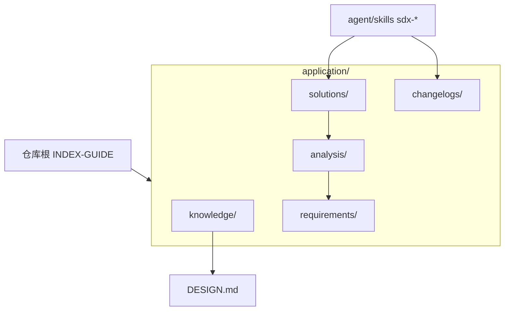

# application INDEX-GUIDE

> **最后更新**: 2026-07-18  
> **文档定位**: 面向 AI Agent 的 **`application/` 文档根**九章索引指南；与目录索引页 [index.md](index.md) 互补。中央知识库挂载建联登记见 **§十**。

---

## 一、项目概览

### 1.1 速查表

| 组件 | 路径 | 描述 |
| ------ | ------ | ------ |
| 应用入口（模式分流） | [README.md](README.md) | `standalone` / `central` 见 [README-s.md](README-s.md)、[README-c.md](README-c.md) |
| 目录索引页 | [index.md](index.md) | `application/` 目录索引与 OKF 渐进披露入口 |
| 设计元模型 | [DESIGN.md](DESIGN.md) | 五视角、实体与演进约束 |
| 贡献与阶段 | [CONTRIBUTING.md](CONTRIBUTING.md) | SDD 阶段、闸门与模板指针 |
| 五视角实体索引 | [knowledge/index.md](knowledge/index.md) | ID 表与证据链（示例级 SSOT） |
| 宪法与术语 | [../agent/knowledge/knowledge-governance.md](../agent/knowledge/knowledge-governance.md) | 治理、命名、ADR |
| 阶段产物目录 | `solutions/`、`analysis/`、`requirements/` | 方案～需求包与元数据 |
| 运维日志 | [changelogs/README.md](changelogs/README.md) | `CHANGE-LOG.md`、`INDEXING-LOG.md` |
| 仓库根九章索引 | [../INDEX-GUIDE.md](../INDEX-GUIDE.md) | 中央库根路径九章地图 |
| OKF 渐进披露 | [index.md](index.md#okf-渐进披露) | `okf_version: 1.0`；bundle 渐进披露入口 |
| OKF 知识索引 | [knowledge/index.md](knowledge/index.md) | 五视角 OKF 子树入口 |

### 1.2 元信息

* **目录角色**: 应用侧知识主库（稳定事实、阶段交付、实现登记与应用层实体）
* **技术栈**: Markdown、YAML、JSON（知识提取产物）
* **已跟踪文件规模**（仅 `application/` 前缀）: **67** 个文件（`git ls-files application/`，2026-06-21）
* **精读深度**: 本轮 **depth=3**（以已读入口与目录枚举为准，非逐文件全文内嵌）

---

## 二、架构视图

### 2.1 模块结构

```text
application/
├── README.md / README-s.md / README-c.md   # 入口与模式说明
├── INDEX-GUIDE.md / index.md               # 九章索引指南 / 目录索引页
├── DESIGN.md / CONTRIBUTING.md             # 元模型与贡献
├── docs-meta.md / manifest.md              # 文档元数据
├── adr/                                    # 应用层 ADR 正文
├── analysis/                               # 需求分析阶段
├── changelogs/                             # CHANGE-LOG、INDEXING-LOG
├── knowledge/                              # 五视角：business/data/product/application/technical
├── requirements/                           # 需求包与 REQUIREMENT-EXAMPLE
├── solutions/                              # 方案阶段与 archive/
└── superpowers/specs/                      # 协作规约与设计产物（通常 gitignore；DOC_DIR=application 时）
```

> **规约路径说明**：SDD 规约 `spec-asd-*.md` 在各需求包 `MVP-Phase-*/specs/`；legacy docs-push 可选 `application/specs/`（中央库可不建）。

### 2.2 依赖关系



### 2.3 包结构

非 JVM 工程；以**目录 + 元数据 Markdown**组织阶段与视角，不以 Java 包分层。

### 2.4 文档目录

* **本索引指南**: [INDEX-GUIDE.md](INDEX-GUIDE.md)
* **目录索引页**: [index.md](index.md)
* **知识实体**: [knowledge/README.md](knowledge/README.md)
* **阶段模板**: 各 `*/README.md`、`requirements/REQUIREMENT-EXAMPLE/`

---

## 三、接口清单

| 小节 | 状态 | 说明 |
| ------ | ------ | ------ |
| 3.1～3.4 | [未索引] | 无运行时 RPC/HTTP/调度/消息；对外契约为文档与 Slash 工作流 |

---

## 四、领域模型

### 4.1 业务术语

| 术语 | 定义 | 落点 |
| ------ | ------ | ------ |
| 五视角 | 业务 / 产品 / 应用 / 数据 / 技术 分层与 ID 规范 | [DESIGN.md](DESIGN.md)、[../agent/knowledge/glossary.md](../agent/knowledge/glossary.md) |
| 知识实体 | YAML/JSON 承载的层级 ID 与关系字段 | [knowledge/](knowledge/) |
| SDD 阶段 | Solution → Analysis → PRD/设计/测试 链 | [CONTRIBUTING.md](CONTRIBUTING.md)、`agent/skills/sdx-*` |

### 4.2 聚合与目录映射

| 聚合 | 职责 | 路径 |
| ------ | ------ | ------ |
| 治理与标准 | 术语、架构原则、命名、ADR 模板 | [../agent/knowledge/README.md](../agent/knowledge/README.md) |
| 五视角知识 | 实体与证据链 | [knowledge/](knowledge/) |
| 阶段包 | 方案、分析、需求树 | [solutions/](solutions/)、[analysis/](analysis/)、[requirements/](requirements/) |

### 4.3 领域服务

| 能力 | 说明 |
| ------ | ------ |
| Slash SDD | `/sdx-solution` 等按参数向导、当前段推进与语义确认写入受管终稿 |
| docs-build | 五视角实体提取与 `KNOWLEDGE_INDEX` 联动（见仓库根九章索引指南 §九） |
| docs-okf | OKF refresh、`index.md`、validate-okf、viz 与产物校验（见 [../agent/skills/docs-okf/SKILL.md](../agent/skills/docs-okf/SKILL.md)） |

### 4.4 领域事件

维护性事件见 [changelogs/CHANGE-LOG.md](changelogs/CHANGE-LOG.md)、[changelogs/INDEXING-LOG.md](changelogs/INDEXING-LOG.md)。

---

## 五、业务逻辑

### 5.1 状态流转（SDD 摘要）

与仓库根九章索引指南一致：方案 → 分析 → PRD → 设计 → 测试；推进协议与写作约束见各 `sdx-*` Skill。

### 5.2 核心流程（本目录）

1. 阅读 [README.md](README.md) 选择 `standalone` / `central` 入口文档。  
2. 变更知识实体或阶段产物时遵守 [DESIGN.md](DESIGN.md) 与 [CONTRIBUTING.md](CONTRIBUTING.md)。  
3. 维护本目录索引：执行 `/docs-indexing` 更新 [INDEX-GUIDE.md](INDEX-GUIDE.md)。

### 5.3 业务规则

* [AGENTS.md](../AGENTS.md)：禁止擅自改实体 ID、未确认不提交
* [DESIGN.md](DESIGN.md)：元模型、映射字段、禁止破坏引用链

### 5.4 枚举

* 知识视角子目录：`business/`、`data/`、`product/`、`application/`、`technical/`

---

## 六、数据映射

### 6.1 数据源

| 数据源 | 类型 | 用途 |
| -------- | ------ | ------ |
| `knowledge/**/{ID}.md` | Markdown（OKF 概念实体 + frontmatter） | 各视角实体文件（SSOT）；校验 `/docs-okf` |

### 6.2～6.4

无 RDBMS；实体映射与关系见 [DESIGN.md](DESIGN.md)、[knowledge/index.md](knowledge/index.md)。SQL 类索引 **[未索引]**。

---

## 七、配置中心

### 7.1 配置项

| 项 | 位置 | 说明 |
| ---- | ------ | ------ |
| 文档元数据 | [docs-meta.md](docs-meta.md)、[knowledge/knowledge-meta.md](knowledge/knowledge-meta.md) | 阶段与目录元信息 |
| manifest | [manifest.md](manifest.md) | 应用清单字段（按项目约定） |

### 7.2 环境差异

中央库模式与独立安装差异见 [README-c.md](README-c.md)、[README-s.md](README-s.md) 及 [../scripts/README.md](../scripts/README.md)。

### 7.3 敏感信息

不在本目录提交真实密钥；仅描述键名与流程。

---

## 八、索引边界

### 8.1 覆盖范围

| 指标 | 值 |
| ------ | ----- |
| `git ls-files application/` | 67 |
| 本轮 mode / depth | `full` / `3` |

### 8.2 排除与未读

* 未纳入：`../system/`、`../company/` 正文（由各自索引覆盖）。  
* 被 `.gitignore` 排除且未入库的路径 **[未索引]**。

### 8.3 维护规则

* 根 `INDEX-GUIDE` 与**本文件**的索引运行均可记入 [changelogs/INDEXING-LOG.md](changelogs/INDEXING-LOG.md)（`output_path` 区分）。  
* 增量前提：主表第一行 `indexing_finished_ms` 有效，见 `agent/skills/docs-indexing/references/indexing-log-spec.md`。

---

## 九、扩展资源

### 9.1 核心文档

| 文档 | 路径 |
| ------ | ------ |
| 仓库根九章索引指南 | [../INDEX-GUIDE.md](../INDEX-GUIDE.md) |
| 目录索引页 | [index.md](index.md) |
| 系统库入口 | [../system/README.md](../system/README.md) |
| Skill 总表 | [../agent/skills/README.md](../agent/skills/README.md) |
| docs-okf | [../agent/skills/docs-okf/SKILL.md](../agent/skills/docs-okf/SKILL.md) |

### 9.2 工具链

Bash 5+、Git；可选 `docs-change` / `docs-build` 与本目录 changelogs 联动。

---

## 十、中央知识库接入工程

本节用于在本仓库（中央知识库）登记各目标工程的接入信息，便于追溯与映射。由 `scripts/docs-install.sh --mode=central`（**中央知识库挂载建联**）维护本表。

| APP ID   | 工程路径（Git 或绝对路径）      | 文档目录                       |
| -------- | ------------------------------- | ------------------------------ |
| APP-TEST | /private/tmp/test-central       | /private/tmp/test-central/docs |

---

**索引元数据**: 本次运行 **mode=full**，**depth=3**，**since_ms=0**，输出 **application/INDEX-GUIDE.md**；运行记录见 [changelogs/INDEXING-LOG.md](changelogs/INDEXING-LOG.md)（2026-06-22）。
