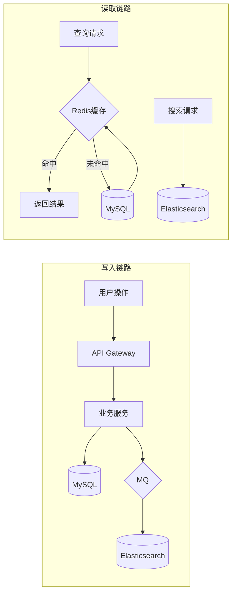

> **模板示例**：本文件为知识库模板示例，实际项目请按需替换内容与 ID。

# 数据架构

## 元信息

| 属性 | 值 |
|------|-----|
| 最后更新 | {YYYY-MM-DD} |
| 关联文档 | [业务视角（领域）](../business/README.md)、[技术架构总览](../technical/SYSTEM-ARCHITECTURE.md) |

## 数据存储全景

| 存储 | 类型 | 用途 | 所属服务 | 数据量级 | 说明文档 |
|------|------|------|---------|---------|----------|
| user_db | MySQL | 用户数据 | svc-user | ~100万行 | 待补充 DS 目录 |
| product_db | MySQL | 商品数据 | svc-product | ~500万行 | 待补充 DS 目录 |
| order_db | MySQL | 订单数据 | svc-order | ~2000万行/年 | [DS-ORDER-MYSQL-PRIMARY](./DS-ORDER-MYSQL-PRIMARY/README.md) |
| inventory_db | MySQL | 库存数据 | svc-inventory | ~500万行 | 待补充 DS 目录 |
| payment_db | MySQL | 支付数据 | svc-payment | ~2000万行/年 | 待补充 DS 目录 |
| redis-cluster | Redis | 缓存/会话/分布式锁 | 共享 | - | - |
| es-cluster | Elasticsearch | 商品搜索索引 | svc-product | ~500万文档 | - |
| oss | 对象存储 | 图片/文件 | 共享 | ~500GB | - |

## 核心表结构（按 DS 分拆）

各数据存储的详细表结构见对应 DS 目录，本处仅做索引：

- **用户库 (user_db)**：待补充 DS 目录后在此链接。
- **订单库 (order_db)**：见 [DS-ORDER-MYSQL-PRIMARY](./DS-ORDER-MYSQL-PRIMARY/README.md)（orders、order_items 及分片策略）。
- 其他库：按需在对应 DS 目录下补充。

## 数据流转图

## 缓存策略

| 缓存Key模式             | 数据来源            | 过期时间            | 更新策略                   | 说明                 |
| ----------------------- | ------------------- | ------------------- | -------------------------- | -------------------- |
| `user:{id}`             | user_db.users       | 30min               | Cache-Aside                | 用户基本信息         |
| `product:{id}`          | product_db.products | 10min               | Cache-Aside + 变更事件失效 | 商品详情             |
| `inventory:{sku}`       | inventory_db        | 不过期              | Write-Through              | 库存数量（高频读写） |
| `token:blacklist:{jti}` | -                   | 与Token过期时间一致 | 写入即生效                 | Token黑名单          |

## 数据分片策略（总览）

分片按数据存储维度在各自 DS 目录中描述，此处仅作汇总：

- **订单库 (order_db)**：orders / order_items 分片见 [DS-ORDER-MYSQL-PRIMARY](./DS-ORDER-MYSQL-PRIMARY/README.md#数据分片策略)。
- 其他库：按需在各 DS 目录补充。

## 数据备份与恢复

| 数据库        | 备份方式    | 频率              | 保留期 | RTO    | RPO    |
| ------------- | ----------- | ----------------- | ------ | ------ | ------ |
| MySQL         | 全量+Binlog | 全量:日/增量:实时 | 30天   | 1小时  | 5分钟  |
| Redis         | RDB + AOF   | RDB:小时/AOF:秒级 | 7天    | 10分钟 | 1秒    |
| Elasticsearch | Snapshot    | 日                | 7天    | 2小时  | 24小时 |
