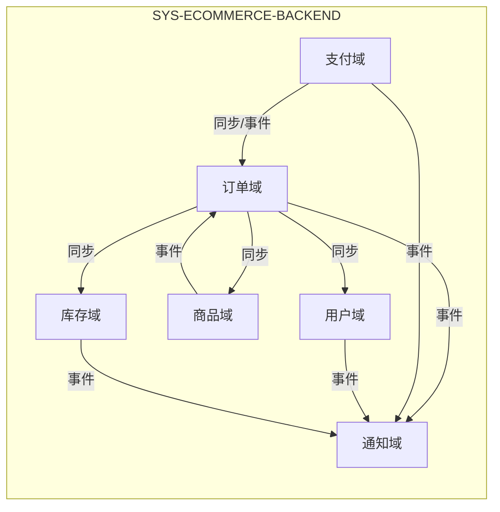

# 系统架构

描述技术视角下**系统与子系统**的职责、边界及相互关系。应用级实现细节见各系统目录下的 [应用架构](SYS-ECOMMERCE-BACKEND/APPLICATION-ARCHITECTURE.md) 与 [集成关系图](SYS-ECOMMERCE-BACKEND/APP-ORDER/INTEGRATION-MAP.md)。

---

## 元信息

| 属性 | 值 |
|------|-----|
| 最后更新 | {YYYY-MM-DD} |
| 关联文档 | [技术视角 README](README.md)、[SYS-ECOMMERCE-BACKEND 应用架构](SYS-ECOMMERCE-BACKEND/APPLICATION-ARCHITECTURE.md)、[集成关系图](SYS-ECOMMERCE-BACKEND/APP-ORDER/INTEGRATION-MAP.md) |

---

## 系统清单

| 系统 ID | 系统名称 | 职责概要 | 边界说明 | 目录 |
|---------|----------|----------|----------|------|
| SYS-ECOMMERCE-BACKEND | 电商后端核心系统 | 支撑电商平台核心业务：用户、商品、订单、支付、库存、通知等 | 仅后端服务与数据；不含前端、不含第三方支付/物流系统实现 | [SYS-ECOMMERCE-BACKEND](./SYS-ECOMMERCE-BACKEND/) |

---

## 系统职责与边界

### SYS-ECOMMERCE-BACKEND（电商后端核心系统）

- **职责**
  - 对外：对前端/客户端提供统一 API（经网关），对第三方提供回调与出站调用。
  - 对内：在系统内完成用户与鉴权、商品与库存、订单与支付、通知等领域的协作，通过同步调用与异步事件保证一致性。
- **边界**
  - **包含**：接入层（API Gateway）、各业务微服务、消息队列、缓存、业务数据库。
  - **不包含**：前端应用、第三方支付/物流/短信的实现细节（仅定义对接方式与契约）；数据归属与 SLA 以本系统为界。
- **与外部关系**
  - 被前端/客户端调用（HTTPS）；调用第三方支付、短信、物流等；与外部系统以接口契约与事件格式为准，不暴露内部子系统划分。

---

## 子系统划分（SYS-ECOMMERCE-BACKEND 内部）

系统内按**领域**划分子系统，每个子系统由一个或多个微服务/应用承载。

| 子系统（领域） | 职责 | 边界 | 主要对外接口/事件 |
|----------------|------|------|--------------------|
| **用户域** | 注册、登录、鉴权、用户信息与收货地址管理 | 仅负责身份与用户主数据；不持有订单、支付数据 | 签发 JWT；提供用户/地址查询；发布 UserRegistered |
| **商品域** | 商品/SKU/分类的 CRUD、搜索索引维护 | 仅负责商品主数据与搜索；不负责库存数量与订单 | 商品查询；发布 ProductUpdated |
| **库存域** | 可用库存、锁定/释放、扣减 | 仅负责库存数量与锁定状态；不解释订单业务含义 | 库存锁定/释放接口；发布 InventoryLow |
| **订单域** | 订单创建、状态机、订单查询与履约协调 | 编排下单流程（调商品/库存/用户），不直接操作支付通道 | 订单 CRUD；发布 OrderCreated / OrderCancelled / OrderShipped |
| **支付域** | 支付发起、回调、退款与支付流水 | 仅负责支付渠道对接与支付状态；订单状态由订单域根据事件更新 | 支付/退款接口；发布 OrderPaid / PaymentRefunded |
| **通知域** | 短信、邮件、站内信、推送 | 仅负责触达与模板；不承载业务规则 | 消费各域事件，对外调用短信/邮件等 |

---

## 子系统间关系

- **协作方式**
  - **同步**：订单域 → 用户域（地址）、商品域（商品信息）、库存域（锁定）；支付域 → 订单域（状态更新）。
  - **异步**：订单域、支付域、用户域、商品域、库存域发布领域事件；通知域消费多域事件；订单域消费 OrderPaid、PaymentRefunded 等。
- **依赖方向**
  - 订单域依赖用户、商品、库存、支付（及事件）；支付域依赖订单（回调/状态更新）；通知域依赖各域事件，不反哺业务状态。
- **边界原则**
  - 各子系统有独立数据存储与限界上下文；跨域一致性通过 Saga/最终一致性与事件驱动保障，详见 [集成关系图](SYS-ECOMMERCE-BACKEND/APP-ORDER/INTEGRATION-MAP.md) 与 [应用架构](SYS-ECOMMERCE-BACKEND/APPLICATION-ARCHITECTURE.md)。

---

## 扩展说明

- 新增**系统**时：在 **`technical_meta.yaml`** 的 `layers`（`key: sys`）中保持字段约定一致，并新建 `{SYS-ID}/` 作系统锚点；在本文「系统清单」「系统职责与边界」中补充一行及一节。
- 新增**子系统**时：在对应系统内扩展「子系统划分」与「子系统间关系」，并同步更新该系统的应用架构与集成关系图。
