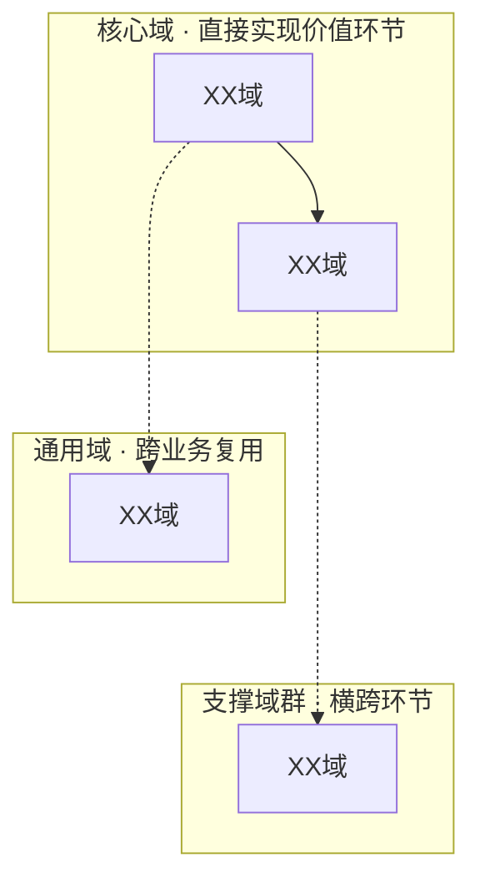

# 业务域划分

[返回 · 业务架构](../README.md)

公司级 L1/L2 业务域划分与域间关系。业务域由价值链VC与业务能力CAP推导而来，遵循 DDD 限界上下文原则划定边界；能力定义见 [业务能力](business-capability.md)，价值链见 [价值链](business-value-chain.md)。

## 核心域
<!-- 一级业务域：直接实现价值环节 -->

| 业务域 | 职责 | 边界 | 能力 |
|---|---|---|---|
| XX域 | 定义与职责 | 做什么，不做什么 | 提供什么能力 |

## 支撑域
<!-- 一级业务域：横跨环节 -->

| 业务域 | 职责 | 边界 | 能力 |
|---|---|---|---|
| XX域 | 定义与职责 | 做什么，不做什么 | 提供什么能力 |

## 通用域
<!-- 一级业务域：跨业务复用 -->

| 业务域 | 职责 | 边界 | 能力 |
|---|---|---|---|
| XX域 | 定义与职责 | 做什么，不做什么 | 提供什么能力 |

## 业务子域

| 业务域 | 业务子域 | 职责 | 边界 | 能力 |
|---|---|---|---|---|
| XX域 | XX子域 | 定义与职责 | 做什么，不做什么 | 提供什么能力 |

## 业务域关系图

## 能力→域映射

完整能力定义见 [业务能力](business-capability.md)。

> 映射一致性约束：每个能力必须有唯一 L1 业务域归属；一个能力可在多个价值环节被调用，但不因跨环节使用而拆成多个能力。

| 能力 | 所在域 | 域群 |
|------|------|------|
| XX能力 | XX域 | 核心域 |
| XX能力 | XX域 | 支撑域 |
| XX能力 | XX域 | 通用域 |

## 实体对齐

| 业务域/子域 | 实体ID |
|------|------|
| XX域 | BD-XX |
| YY子域 | BSD-YY |

