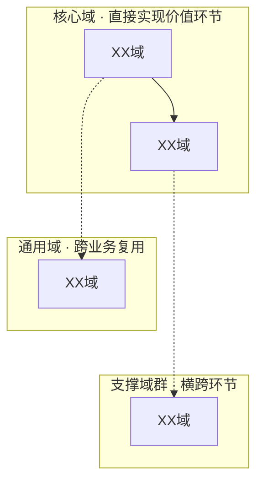

# 业务域划分

[返回 · 业务架构](../README.md)

**结论**：公司级 BD 与 BSD-L1 由价值链与能力推导，按 DDD 限界上下文定界。能力见 [业务能力](business-capability.md)；价值链见 [价值链](business-value-chain.md)。

## 核心域

直接实现价值环节的一级域。

| 业务域 | 职责 | 边界 | 能力 |
|---|---|---|---|
| XX域 | 定义与职责 | 做什么 / 不做什么 | 提供什么能力 |

## 支撑域

横跨价值环节的一级域。

| 业务域 | 职责 | 边界 | 能力 |
|---|---|---|---|
| XX域 | 定义与职责 | 做什么 / 不做什么 | 提供什么能力 |

## 通用域

跨业务复用的一级域。

| 业务域 | 职责 | 边界 | 能力 |
|---|---|---|---|
| XX域 | 定义与职责 | 做什么 / 不做什么 | 提供什么能力 |

## 业务子域

| 业务域 | 业务子域 | 职责 | 边界 | 能力 |
|---|---|---|---|---|
| XX域 | XX子域 | 定义与职责 | 做什么 / 不做什么 | 提供什么能力 |

## 业务域关系图

```mermaid
graph TB
    subgraph 核心域["核心域 · 直接实现价值环节"]
        direction LR
        DOM_SALE["XX域"] --> DOM_ORDER["XX域"]
    end

    subgraph 支撑域群["支撑域群 · 横跨环节"]
        DOM_FULFILL["XX域"]
    end

    subgraph 通用域群["通用域 · 跨业务复用"]
        DOM_COMMON["XX域"]
    end

    DOM_ORDER -..-> DOM_FULFILL
    DOM_SALE -..-> DOM_COMMON
```
