<!-- _class: lead -->

# Harness 工程实践：SSOT 知识库 + Skills 链让 AI 交付可控

**听众**：架构师、研发负责人  
**时长**：45 分钟（含 Q&A）

基于 [ai-knowledge](https://github.com/oleewen/ai-knowledge) 元知识底座实践

讲稿全文：[Harness工程实践：SSOT知识库+Skills链让AI交付可控.md](./Harness工程实践：SSOT知识库+Skills链让AI交付可控.md)

---

## 分享内容

1. **为什么需要 AI 知识库**  
   LLM + Harness · 知识混沌六象 · SSOT vs Wiki + RAG

2. **知识库分层架构与模型**  
   公司 → 系统 → 应用 · 五视角 · 实体首次定义层级

3. **知识库构建与需求交付 Skills 闭环**  
   `docs-*` 构建链 · `sdx-*` 交付链 · 萃取 / 蒸馏 / 归档 · Gate 治理

4. **从零起步构建知识库**  
   选型口诀 · 场景 A–D（独立 / 新系统 / 老系统 / 散落文档）· 变更闭环

5. **企业应用案例**  
   返利计费（C + D · 聚合提纯）· 增值计费（B + D · MVP 迭代）

6. **总结与落地建议**  
   核心结论 · 四步落地路径 · 最小闭环验收

---

<!-- _class: lead -->

# §1 为什么需要 AI 知识库

---

## Agent = LLM + Harness


| 分工 | 谁提供 | 提供什么 |
| --- | --- | --- |
| Agent | AI Agent | 上下文、工具、权限 |
| DevOps | 云平台 | 可观测、行动能力 |
| **工程** | **工程团队** | **知识 — SSOT + SKILLS** |

---

## 知识黑洞：瓶颈不在基模的智力，而在知识的混沌

企业落地 AI 时，基模智力决定产出的上限，业务知识决定产出的下限，反复出现的瓶颈是 **知识混沌**。

| 现象 | 后果 |
| --- | --- |
| **知识缺失**：规则只存在于硬编码、同事脑中，AI 无法获取 | 边界靠猜，产出不稳定 |
| **知识散落**：碎片存于 Wiki、协作文档、邮件、代码注释 | 噪声大，上下文不全，RAG 碰运气 |
| **知识混淆**：PRD、接口文档、数据字典术语各说各话 | 通用语言约束失效，Agent 读了也猜 |
| **知识冲突**：不同文档对同一件事表述矛盾，不知谁对 | 产出对错难料，人工兜底成本高 |
| **知识老化**：文档写完就不更新，代码早变了文档还是旧的 | 越用越偏，错误知识比没有更危险 |
| **知识孤岛**：各团队/系统自有一套，跨团队无法互通引用 | 重复建设，上下游对不齐，治理无从落地 |

---

## SSOT 知识库的诸项优势

| 优势 | 混沌知识库 | SSOT 知识库 |
| --- | --- | --- |
| **知识集中** | Wiki、文档、代码中散落，知识碎片化，RAG 碰运气 | 一处定义，他处引用，精确导航，RAG 有依据 |
| **术语统一** | 各项文档术语各说各话，术语对不齐理不清 | 多视角 + 角色契约，跨团队通用语言 |
| **职责清晰** | 业务范围、规则靠猜，不知谁对谁错 | 清晰的职责边界定义，作用上下文约束 |
| **联邦互通** | 各系统/团队独立成库，上下游对不齐，重复建设 | 公司→系统→应用分层挂载，跨团队引用，联邦治理落地 |
| **易更新可溯源** | 代码改了，文档没人更新，或不知谁什么时候改了 | Git 版本管理 + 变更日志 + 更新 / 抽取 / 蒸馏闭环 |

---

<!-- _class: lead -->

# §2 知识库分层架构与模型

---

## 联邦三层：公司 → 系统 → 应用

| 层级 | 职责 |
| --- | --- |
| **公司** `company/` | 企业架构视角；`system-{name}/` 系统镜像槽位 |
| **系统** `system/` | 系统架构五视角；边界与多应用聚合 |
| **应用** `application/` | 应用架构四视角；实体 SSOT 与实现细节 |

- **SSOT**：实体只在一处定义，跨文件仅 **ID** 引用
- **联邦**：公司管业务划分 → 系统管职责边界 → 应用管实现细节

```text
company/            system/              application/
├ ea/               ├ architecture/      ├ knowledge/ 
│ └ overview/       │ └ overview/        │ └ KNOWLEDGE_INDEX.md
├ system-*/         ├ application-*/     ├ solutions/
├ solutions/        ├ solutions/         ├ analysis/
├ analysis/         ├ analysis/          ├ requirements/
└ changelogs/       ├ requirements/      ├ adr/
                    ├ adr/               └ changelogs/
                    └ changelogs/      
```

---

## 知识库架构元模型

| 视角 | 回答什么问题 | 主要内容 |
| --- | --- | --- |
| **业务视角** | 做什么业务、边界在哪、流程与能力如何组织 | 业务概述、业务域划分、商业模式、价值链、业务能力、业务术语、业务流程、能力地图 |
| **产品视角** | 用户是谁、功能如何组织、旅程与场景 | 产品概述、产品架构、信息架构、产品功能、用户旅程、度量标准、体验设计、版本发布、运营支撑、多端策略 |
| **应用视角** | 系统如何拆分、服务如何协作、领域与集成边界 | 系统概述、应用架构、领域模型、服务设计、领域能力、集成架构、服务交互、接口管理、多租户环境、ADR |
| **数据视角** | 数据如何建模、存储、流转与治理 | 数据概述、数据治理、数仓与湖、数据安全、数据模型、数据存储、数据分析、数据流转 |
| **技术视角** | 如何运行、扩展、观测与交付 | 技术概述、基础设施、部署架构、中间件、性能扩展、高可用与容灾、可观测性、DevOps、技术安全、开发环境 |

## 知识库实体元模型

五视角实体定义：

| 视角 | 实体 |
| --- | --- |
| **业务** business | 业务域 BD → 业务子域 BSD → 限界上下文 BC → 聚合 AGG → 领域能力 AB；业务域 BD → 业务能力 CAP |
| **产品** product | 产品线 PL → 产品模块 PM → 流程 BP → 功能 FT → 用户用例 UC → 业务规则 BR |
| **应用** application | 系统 SYS → 应用 APP → 服务 MS → 接口 API |
| **数据** data | 数据域 MDG → 数据存储 DS → 数据实体 ENT → 数据表 TBL |
| **技术** technical | 平台能力 TPL → 系统技术 TSD → 中间件绑定 MW → 关键组件 CMP |

实体首次定义层级（SSOT 以对应层级 meta/entities 为准）

| 定义知识库 | 视角 | 实体 |
| --- | --- | --- |
| **公司知识库** | 业务 | 业务域 BD |
| | | 业务能力 CAP |
| | 产品 | 产品线 PL |
| | 应用 | 系统 SYS |
| | 数据 | 数据域 MDG |
| | 技术 | 平台能力 TPL |
| **系统知识库** | 业务 | 业务子域 BSD |
| | | 限界上下文 BC |
| | | 聚合 AGG |
| | | 领域能力 AB |
| | 产品 | 产品模块 PM |
| | | 流程 BP |
| | | 功能 FT |
| | | 用户用例 UC |
| | | 业务规则 BR |
| | 应用 | 应用 APP |
| | | 服务 MS |
| | 数据 | 数据存储 DS |
| | | 数据实体 ENT |
| | 技术 | 系统技术 TSD |
| **应用知识库** | 应用 | 接口 API |
| | 数据 | 数据表 TBL |
| | 技术 | 中间件绑定 MW |
| | | 关键组件 CMP |

---

<!-- _class: lead -->

# §3 知识库构建与需求交付 Skills 闭环

Agent 在工程里稳定交付，不是靠一次对话“猜对上下文”，而是靠一组按阶段协作的 Skills 串起知识构建与需求交付。  

## 构建链与交付链闭环

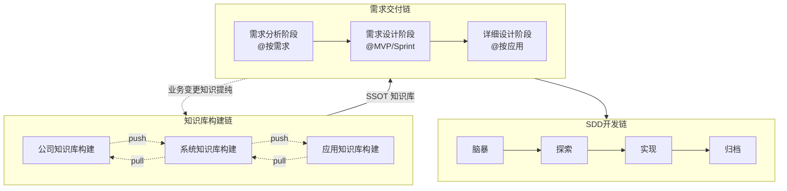

先有知识底座，再做需求交付；交付产物再反哺知识库，这就是 Skills 链让 AI 交付可控的核心。

## 知识库构建链

`docs-*` 负责把散落文档、联邦镜像与结构化章节沉淀为可治理知识。

### 应用知识库构建

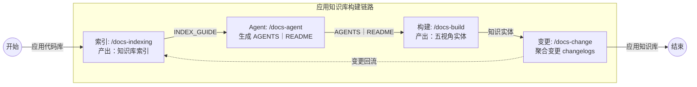

### 系统｜公司知识库构建

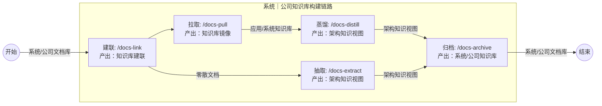

## 需求交付链

`sdx-*` 负责把业务想法逐步收敛为可评审、可实现、可测试的规约。

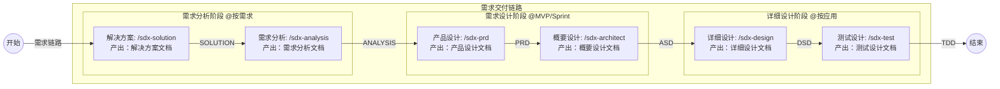
---

## 知识提纯：萃取 + 蒸馏

知识 Overview 缓冲区：`overview/*-overview.md` = **散落知识 → 结构化章节的缓冲区**

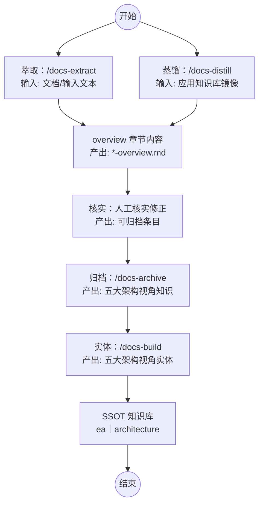

---

## 治理闸门：有效预防失之毫厘谬以千里

Skill 引入了类似 `superpowers:brainstorming` 类似的闸门机制，确保生成内容每个段落都有人工参与纠正、确认。

闸门的作用，不是增加流程，而是防止 AI 幻觉被逐步地无限放大，幻觉第一时间得以纠正，同时还能节省大量Token。

- 通过段式闸门，确保内容一段一段地被调整、确认
- 在已确认内容基础上，逐步产出后续内容，而不是整篇“先写再修”
- 把高风险写入锚定在人工确认点，确保始终锚定靶心、不偏离

---

<!-- _class: lead -->

# §4 从零起步构建知识库

---

## 选型口诀

```text
有应用仓     → bootstrap + build
有多应用     → 中央 link + pull/distill
只有 legacy  → extract → archive → build
```

操作 SSOT：[quick-start.md](../../../quick-start.md)

---

## 场景 A：独立应用

**适用**：单一应用仓，无需联邦

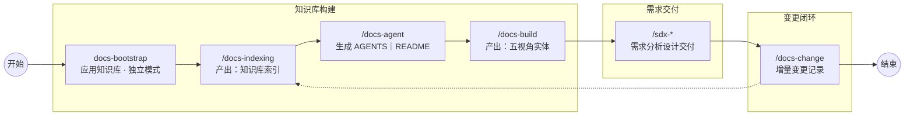

---

## 场景 B：新系统 + 中央库

**适用**：Greenfield 多应用，**自上而下**

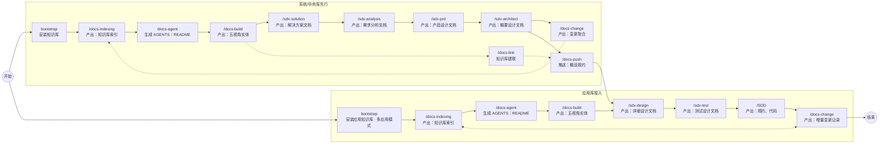

---

## 场景 C：老系统 + 中央库

**适用**：已有多个应用仓，**自下而上**

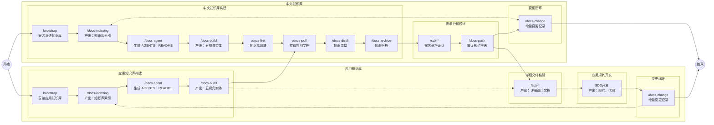

---

## 场景 D：从散落文档萃取知识库

**适用**：Wiki / 协作文档散落，尚无结构化库

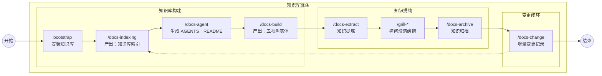

**原则**：overview → archive → entity — 不要硬造 YAML

---

## 场景对照一览

| 场景 | 起点 | 关键词 |
| --- | --- | --- |
| **A** | 单应用仓 | standalone · 无联邦 |
| **B** | 新系统 + 中央库 | 系统先需求分析/概要设计 |
| **C** | 老系统 + 多应用 | 应用先 SSOT · 再聚合提纯 |
| **D** | 散落文档 | 从散落文档萃取知识库 |

---

<!-- _class: lead -->

# §5 企业应用案例

---

## 案例 1：返利计费 — 新增计费规约

- 结合 C + D 场景
- 先构建应用知识库，再聚合提纯为中央知识库
- 从散落文档萃取知识，补充中央知识库

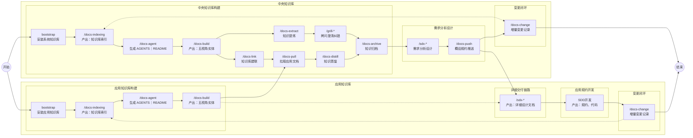

 

---

## 案例 2：增值计费 — MVP 迭代

| 步骤 | 场景 | 要点 |
| --- | --- | --- |
| 建库 | B + D | 系统库 + overview 缓冲区 |
| 拆分 | analysis | MVP：采集 → 规则引擎 → 出账对账 |
| 概设 | 按 MVP | PRD/ASD/spec-asd **分阶段**，不一次铺开 |
| 落地 | 迭代 | 每 MVP：push → 详设 → 开发 → 上行对齐 |

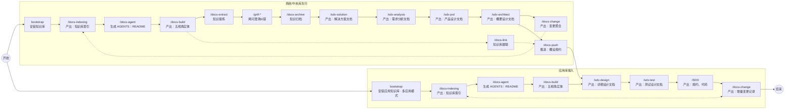


---

<!-- _class: lead -->

# §6 总结与落地建议

---

## 核心结论

| # | 结论 | 一句话 |
| --- | --- | --- |
| 1 | **瓶颈不在模型，在知识混沌** | 缺失 · 散落 · 混淆 · 冲突 · 老化 · 孤岛 — 这才是 AI 落地失控的真正原因 |
| 2 | **Harness = SSOT + Skills 链** | 知识构建链（`docs-*`）× 需求交付链（`sdx-*`）双链路闭环，让交付可预期、可复用、可审计 |
| 3 | **联邦三层，各守其位** | 应用管实现细节 · 系统管职责边界 · 公司管业务划分；实体在首次定义处为 SSOT，他处仅 ID 引用 |
| 4 | **场景先行，最小闭环优先** | A/B/C/D 对号入座，先跑通一条链路，再逐步扩展；Gate 护航，防止幻觉被放大 |
| 5 | **蒸馏 / 萃取 / 归档最耗时耗力** | distill/extract/archive 分阶段推进 |

---

## 落地路径

| 阶段 | 做什么 | 对应场景 |
| --- | --- | --- |
| **第 1 步** | `bootstrap` → `docs-indexing` → `docs-agent`<br/>跑通知识库基础闭环 | A / B / C / D 均从此起步 |
| **第 2 步** | `docs-build` 提取五视角实体<br/>legacy 文档先 `docs-extract` → `docs-archive` | A（独立应用）/ D（散落文档） |
| **第 3 步** | `docs-link` + `docs-pull` / `docs-distill` <br/>接入中央库，建联并上行对齐 | B（新系统自上而下）/ C（老系统自下而上） |
| **第 4 步** | `sdx-*` 需求交付 + `docs-push` 规约下行<br/>知识底座就绪后接入交付链 | 全场景 |
| **持续** | `docs-change` 增量上行 · Gate 治理 · 迭代扩展 | — |

**验收**：Agent 能按 INDEX 引用实体 ID · 一条 `spec-asd` 完成 DSD 落盘

---

<!-- _class: lead -->
<!-- _paginate: false -->

# 谢谢

> AI 的上限是模型，AI 的下限是知识。  
> **SSOT + Skills 链，让下限撑起上限。**

**仓库**：[github.com/oleewen/ai-knowledge](https://github.com/oleewen/ai-knowledge)


---
