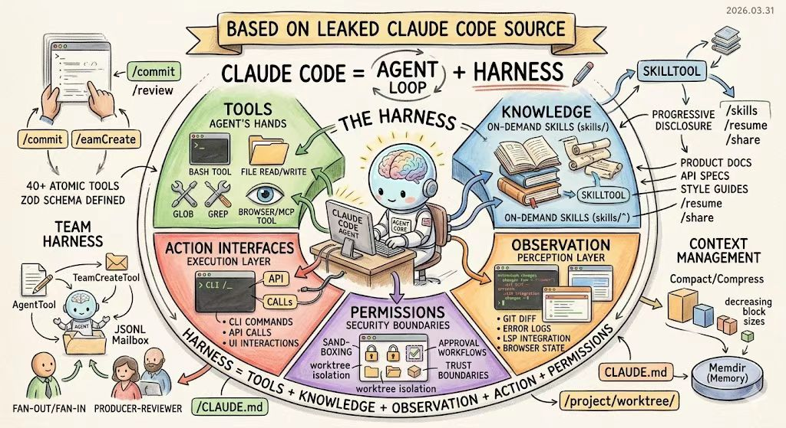
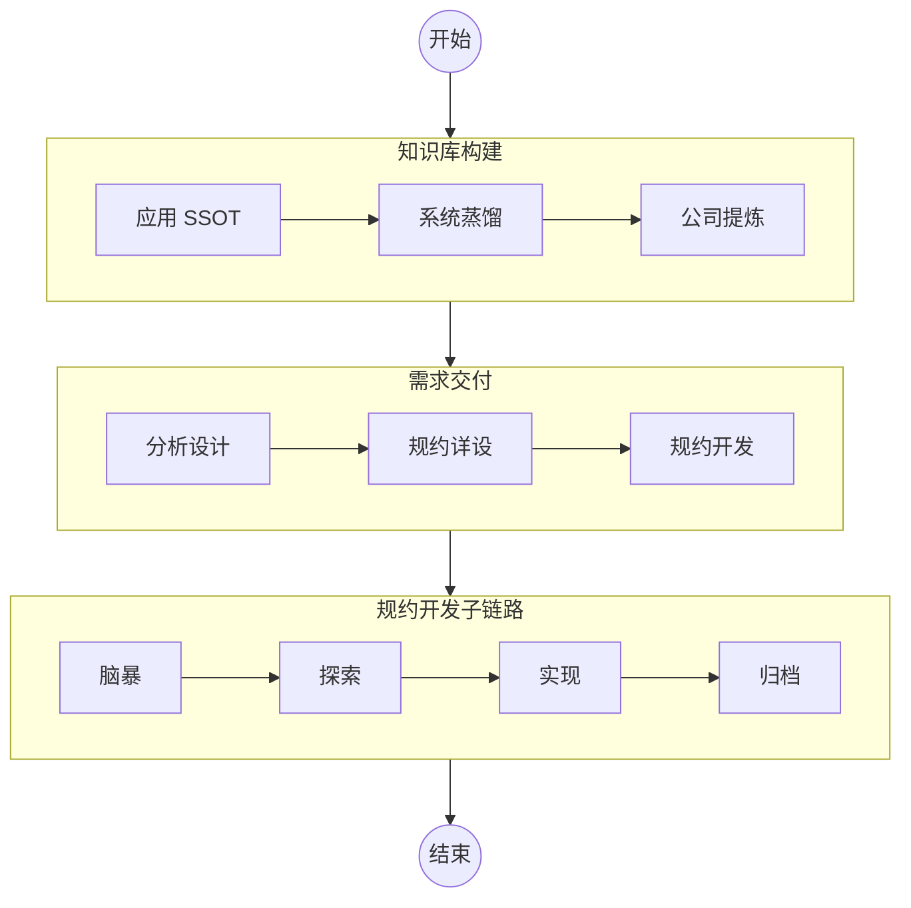
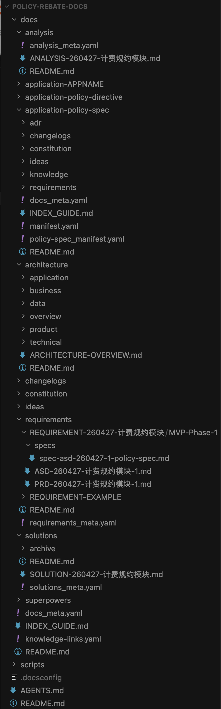
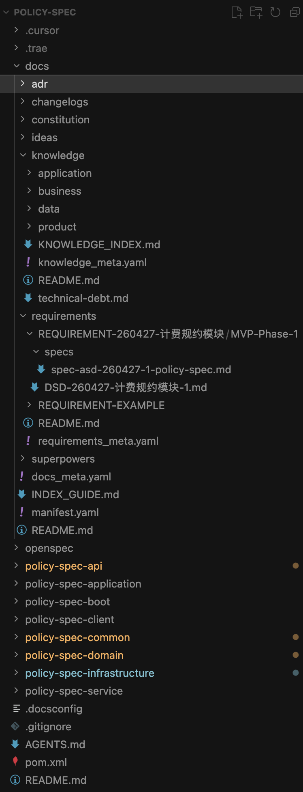
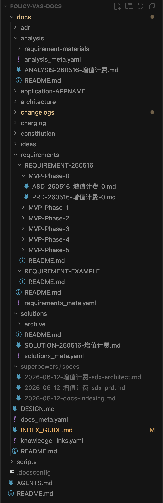
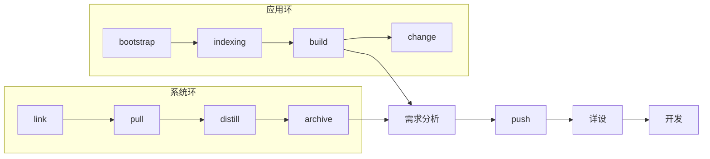

<!-- _class: lead -->

# 用企业 AI 知识库底座，激活组织知识

**听众**：架构师、研发负责人  
**时长**：45 分钟（含 Q&A）

基于 [ai-knowledge](https://github.com/oleewen/ai-knowledge) 元知识底座实践

讲稿全文：[用企业AI知识库底座，激活组织知识.md](./用企业AI知识库底座，激活组织知识.md)

---

## 分享内容

1. **为什么需要 AI 知识库和元底座**  
   Agent = Harness · 知识黑洞 · SSOT vs Wiki + RAG

2. **知识库分层架构与模型**  
   公司 → 系统 → 应用 · 五/四视角 · overview 缓冲区

3. **知识的流通与沉淀**  
   双链路闭环 · Skill 链 · Gate 治理

4. **从零起步构建知识库**  
   选型口诀 · 场景 A–D（独立应用 / 新系统 / 老系统 / legacy）

5. **企业应用案例**  
   返利计费 · 增值计费（MVP 迭代）

6. **总结与落地建议**

---

<!-- _class: lead -->

# §1
# 为什么需要 AI 知识库

---

## Agent = LLM + Harness



| 分工 | 谁提供 | 提供什么 |
| --- | --- | --- |
| Agent | AI Agent | 上下文、工具、权限 |
| DevOps | 云平台 | 可观测、行动能力 |
| **工程** | **工程团队** | **知识 — SSOT + SKILLS** |

---

## 知识黑洞：瓶颈不在基模的智力，而在知识的混沌

企业落地 AI 时，基模智力决定产出的上限，业务知识决定产出的下限，反复出现的瓶颈是 **知识混沌**。

| 现象 | 后果 |
| --- | --- |
| 知识散落：知识碎片存在于Wiki、协作文档、邮件 |  噪声大，上下文不全，难评估，RAG 碰运气 |
| 知识混淆：各项文档术语各说各话，业务/产品/技术术语对不齐 | 行动前，通用语言约束失效 |
| 知识冲突：不同文档对同一件事情的表述有冲突，不知谁对谁错 | 产出对错难料 |
| 知识缺失：有特定规则只存在于特定硬编码、同事脑中，AI无法获取 | 边界靠猜，产出不稳定 |

---

## SSOT 知识库的诸项优势

| 优势 | 混沌知识库 | SSOT 知识库 |
| --- | --- | --- |
| **知识集中** | Wiki、文档、代码中散落，知识碎片化，RAG 碰运气 | 一处定义，他处引用，精确导航，RAG 有依据 |
| **术语统一** | 各项文档术语各说各话，术语对不齐理不清 | 多视角 + 角色契约，跨团队通用语言 |
| **职责清晰** | 业务范围、规则靠猜，不知谁对谁错 | 清晰的职责边界定义，作用上下文约束 |
| **持续更新** | 代码改了，文档没人更新，版本冲突 | Git 版本管理 + 变更日志 + 更新 / 抽取 / 蒸馏闭环 |

---

<!-- _class: lead -->

# §2
# 知识库分层架构与模型

---

## 联邦三层：公司 → 系统 → 应用

| 层级 | 职责 |
| --- | --- |
| **公司** `company/` | 顶层架构视角；`system-{name}/` 镜像槽位 |
| **系统** `system/` | **五架构视角**；边界与多应用聚合 |
| **应用** `application/` | **四架构视角**；实现细节与实体 SSOT |

- **SSOT**：实体只在一处定义，跨文件仅 **ID** 引用
- **联邦**：公司管划分 → 系统管边界 → 应用管实现并 **上行对齐**

---

## 五视角 vs 四视角

| 系统层（5） | 应用层（4） |
| --- | --- |
| 业务 · 产品 · **应用** · 数据 · 技术 | 业务 · 产品 · 数据 · 技术 |

**应用架构边界**（服务拆分、集成）在 **系统层** 定义  
应用层 `knowledge/` 聚焦 **实现与实体 SSOT**

---

## 目录骨架（精要）

```text
company/          system/                 application/
├ architecture/   ├ architecture/         ├ knowledge/      ← 四视角实体
│ └ overview/     │ └ overview/           ├ solutions/
├ system-*/       ├ application-*/        ├ requirements/
└ changelogs/     ├ solutions/            └ changelogs/
                  ├ analysis/
                  └ requirements/
```

---

## Overview 缓冲区

`overview/*-overview.md` = **散落知识 → 结构化章节的缓冲区**

| 阶段 | Skill | 产出 |
| --- | --- | --- |
| 抽取 | `/docs-extract` | 第三列草稿 |
| 核实 | 人工 | 可归档条目 |
| 归档 | `/docs-archive` | `architecture/` 各视角 |
| 实体 | `/docs-build` | 四视角实体 + `KNOWLEDGE_INDEX` |

> **最终 SSOT** 在 `architecture/`，不在 overview

---

## 实体首次定义层级（示例）

| 实体 | 首次定义 |
| --- | --- |
| 业务域 BD · 产品线 PL · 系统层 SYS | **公司** |
| 业务子域 BSD · 应用层 APP · 数据层 DS | **系统** |
| BC · AGG · API · ENT · TBL · FT · UC · BR | **应用** |

他处仅 ID 引用，正文不冗余同步

---

<!-- _class: lead -->

# §3
# 知识的流通与沉淀

---

## 双链路闭环

**双链路** = **知识库构建** + **需求交付**（含规约开发第三段）


**相互喂料**：系统库出概设 → 应用库落详设与实现 → 归档回写知识库

---

## 执行主流程（现场必讲）



§3.2 / §3.3 详图见讲稿附录 B（会后深读）

---

## 需求交付 Skill 链（精要）

| 阶段 | Skill 链 | 产出 |
| --- | --- | --- |
| 分析设计 | `/sdx-solution` → … → `/sdx-architect` | SOLUTION … ASD · spec-asd |
| 规约详设 | `/sdx-design` → `/sdx-test` | DSD · TDD |
| 规约开发 | `superpowers:brainstorming` → `opsx:*` → `superpowers:sdd` → `opsx:archive` | 代码 + 规格回写 |

- **`sdx-*`**：阶段文档（Spec-Driven Development）
- **`opsx:*`**：DSD/TDD → 代码与文档回写

---

## Gate：落盘前的治理闸门

`/docs-indexing` 等高风险 Skill：

1. 写会话 spec（`{DOC_DIR}/superpowers/specs/*-docs-indexing.md`）
2. **用户总确认** → `<!-- docs-indexing-gate: CONFIRMED -->`
3. 才允许写入 `INDEX_GUIDE.md` / `INDEXING-LOG.md`

> 索引是 Agent 的「地图」— 不可自动乱写

---

<!-- _class: lead -->

# §4
# 从零起步构建知识库

---

## 选型口诀

```text
有应用仓     → bootstrap + build
有多应用     → 中央 link + pull/distill
只有 legacy  → extract → archive → build
```

操作 SSOT：[docs/getting-started.md](../../../docs/getting-started.md)

---

## 场景 A：独立应用

**适用**：单一应用仓，无需联邦

| # | 动作 |
| --- | --- |
| 1 | `docs-bootstrap`（standalone · application） |
| 2 | `/docs-indexing`（gate）+ `/docs-agent` |
| 3 | `/docs-build` |
| 4 | 按需 `/sdx-*` 需求交付 |
| 5 | `/docs-change` + 定期 indexing |

---

## 场景 B：新系统 + 中央库

**适用**：Greenfield 多应用，**自上而下**

1. **系统库先行** — bootstrap → indexing → `/sdx-solution` … `/sdx-architect`
2. **应用库接入** — link → `/docs-push` spec-asd → `/sdx-design` → 规约开发
3. **变更闭环** — `/docs-change` + 增量 indexing

系统/公司库承载 **需求与概设 SSOT**

---

## 场景 C：老系统 + 中央库

**适用**：已有多个应用仓，**自下而上**

1. **各应用先 SSOT** — bootstrap → extract（按需）→ build
2. **建中央库聚合** — link → pull → distill → archive
3. **接续需求交付** — sdx 链路 + push 下行 + 详设开发
4. **持续上行** — change + pull + distill `--since`

---

## 场景 D：仅 legacy 文档

**适用**：Wiki / 协作文档散落，尚无结构化库

```text
bootstrap → indexing → 盘点源
    → /docs-extract（overview 第三列）
    → 人工核实（术语·边界 优先）
    → /docs-archive → /docs-build
```

**原则**：overview → archive → entity — 不要硬造 YAML

---

## 场景对照一览

| 场景 | 起点 | 关键词 |
| --- | --- | --- |
| **A** | 单应用仓 | standalone · 无联邦 |
| **B** | 新系统中央库 | 系统先需求/概设 |
| **C** | 老系统多应用 | 应用先 SSOT · 再聚合 |
| **D** | 仅 legacy | extract · overview 缓冲区 |

---

<!-- _class: lead -->

# §5
# 企业应用案例

---

## 案例 1：返利计费 — 新增计费规约

| 步骤 | 场景 | 要点 |
| --- | --- | --- |
| 建库 | C + D | 应用 SSOT → 中央 pull/distill/archive |
| 需求 | sdx 链路 | SOLUTION … spec-asd（系统库 SSOT） |
| 详设 | 新建 policy-spec | push 下行 → DSD/TDD |
| 实现 | 规约开发 | change 回写 · 中央 distill 上行 |

 

---

## 案例 2：增值计费 — MVP 迭代

| 步骤 | 场景 | 要点 |
| --- | --- | --- |
| 建库 | B + D | 系统库 + overview 缓冲区 |
| 拆分 | analysis | MVP：采集 → 规则引擎 → 出账对账 |
| 概设 | 按 MVP | PRD/ASD/spec-asd **分阶段**，不一次铺开 |
| 落地 | 迭代 | 每 MVP：push → 详设 → 开发 → 上行对齐 |



---

<!-- _class: lead -->

# §6
# 总结与落地建议

---

## 五条核心结论

1. **Agent = Model + Harness** — 稳定交付靠 SSOT + Skills，不只在模型
2. **双链路闭环** — 知识构建 ↔ 需求交付，相互喂料
3. **联邦三层各守其位** — 应用实现 · 系统边界 · 公司划分
4. **先选对场景，再跑最小闭环** — 不必一次上全链路
5. **蒸馏 / 抽取 / 归档最耗力** — overview → archive → entity 分阶段推进

---

## 落地建议

| 时间 | 做什么 |
| --- | --- |
| **第 1 周** | 对号入座 A–D；跑通 bootstrap → indexing（gate）→ docs-agent |
| **第 2–4 周** | legacy 盘点 · extract · 架构师核实 · archive · build |
| **第 2 月起** | 接入 sdx 需求交付 · docs-push 下行规约 |
| **持续** | docs-change · pull/distill 上行 · 增量 gate |

**验收**：Agent 能按 INDEX 引用实体 ID · 或一条 spec-asd 完成 DSD 落盘

---

## 今天带走什么

- **Agent = Model + Harness** — 知识 SSOT 才是稳定交付的关键
- **公司 → 系统 → 应用** 三层联邦 + 知识↔需求双链路闭环
- SSOT 知识库 vs「Wiki + RAG」：**确定性、可复用、可审计**
- 按现状选型：**独立应用 / 新系统 / 老系统 / legacy 文档**

---

<!-- _class: lead -->

# Q&A

常见问题见讲稿 **附录 D**

- Wiki + RAG 有何不同？
- 场景 B vs C 怎么选？
- gate 谁来做？
- central vs standalone？
- 从哪里开始抄作业？ → [getting-started.md](../../../docs/getting-started.md)

---

<!-- _class: lead -->
<!-- _paginate: false -->

# 谢谢

**仓库**：[github.com/oleewen/ai-knowledge](https://github.com/oleewen/ai-knowledge)

讲稿 · 附录 · 详图：[用企业AI知识库底座，激活组织知识.md](./用企业AI知识库底座，激活组织知识.md)

---

<!-- ============================================================ -->
<!-- 以下为备份页（Backup）— 现场时间充裕或 Q&A 深问时展开，默认跳过 -->
<!-- ============================================================ -->

<!-- _class: lead -->

# 备份 · 知识库子流程



---

## 备份 · 实体元模型全表

| 视角 | 实体 | 层级 |
| --- | --- | --- |
| business | BD · BSD · BC · AGG · AB | 公司 / 系统 / 应用 |
| product | PL · PM · FT · UC · BR | 公司 / 系统 / 应用 |
| application | SYS · APP · MS · API | 公司 / 系统 / 应用 |
| data | DS · ENT · TBL | 系统 / 应用 |

详见 [application/DESIGN.md §2.2.1](../../../application/DESIGN.md#221-跨层实体首次定义层级)

---

## 备份 · 术语速查

| 术语 | 含义 |
| --- | --- |
| SSOT | 实体一处定义，他处 ID 引用 |
| Gate | 高风险 Skill 落盘前用户总确认 |
| overview 第三列 | 待核实提炼区，非最终 SSOT |
| superpowers:* | Cursor Superpowers 插件 Skill |
| opsx:* | 规约开发：explore → ff → apply → archive |

---

## 备份 · 蒸馏质量 Checklist（精要）

- [ ] spec **CONFIRMED** · overview 文件名 `{APPNAME}-overview.md`
- [ ] 五架构视角各行已处理 · 摘要非复制 · A/U/D 正确
- [ ] 核实顺序：**术语与边界** → 流程与接口
- [ ] archive → build · 联邦 pull/distill 与 changelogs 对齐

完整清单见讲稿 [附录 C](./用企业AI知识库底座，激活组织知识.md#附录-c-蒸馏与质量-checklist)
