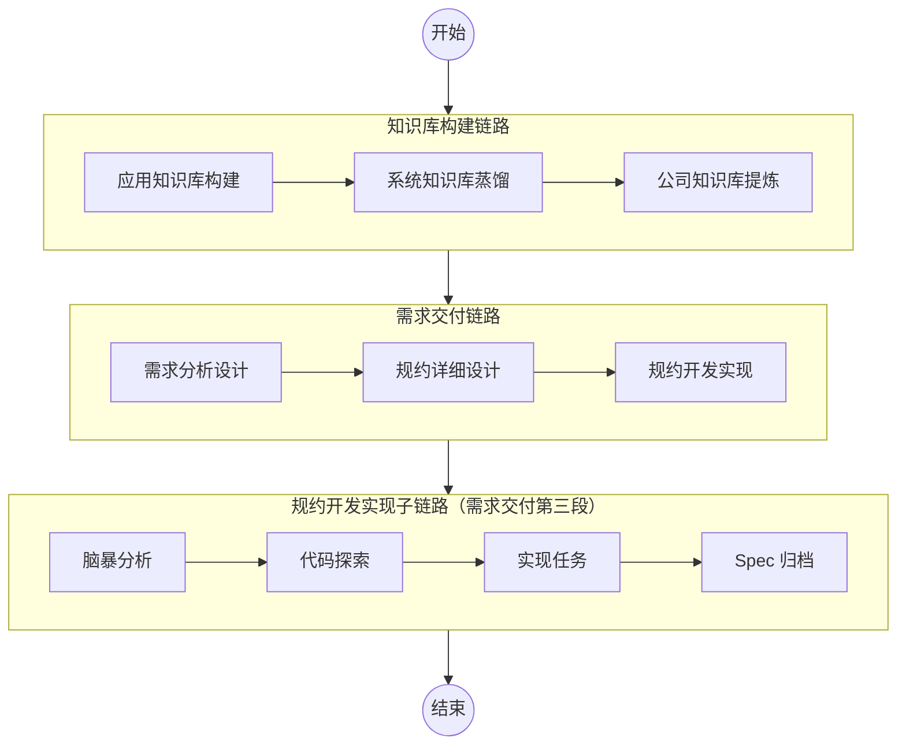
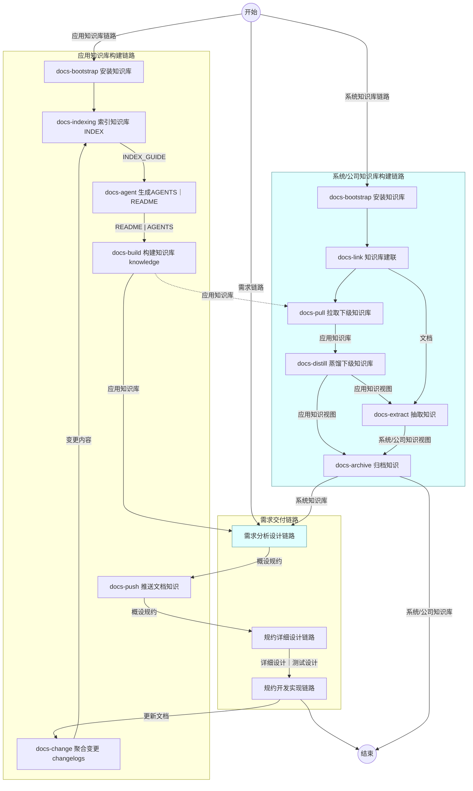
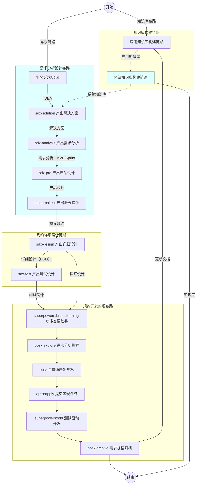

# 用企业 AI 知识库底座，激活组织知识

> **听众**：架构师、研发负责人  
> **时长**：45 分钟（含约 5 分钟 Q&A 预留）  
> **实践来源**：基于 [ai-knowledge](https://github.com/oleewen/ai-knowledge) 元知识底座的设计与 Skill 链路  
> **用法**：正文按讲稿节奏组织；附录供会后查阅，不必逐字念。PPT 分页版（Marp）见 [用企业AI知识库底座，激活组织知识-slides.md](./用企业AI知识库底座，激活组织知识-slides.md)。

## 议题简介

企业推 AI Agent，瓶颈常在知识散落、无单一事实源（SSOT）——RAG 碰运气，输出不稳定、不可审计。本分享基于开源元知识底座 **ai-knowledge** 实践，介绍如何用 **联邦分层知识库 + Agent Skills** 把 Wiki 与协作文档沉淀为可引用、可治理的组织知识，并给出四类典型场景的选型路径与企业案例。

## 听众收获

- 理解 **Agent = Model + Harness**，明确知识 SSOT 才是稳定交付的关键  
- 掌握 **公司 → 系统 → 应用** 三层联邦分工与知识↔需求双链路闭环  
- 区分 SSOT 知识库与「Wiki + RAG」：确定性、可复用、可审计  
- 按组织现状（独立应用 / 新系统 / 老系统 / legacy 文档）带走可执行的起步路径  

---

## 讲者提纲（45 min）

| 时段 | 章节 | 要点 | 建议时长 |
| --- | --- | --- | --- |
| 0:00 | [§1 为什么需要](#1-为什么需要ai知识库和元底座) | Agent = Model + Harness；知识黑洞；元底座定位；SSOT vs RAG、治理与审计 | 8 min |
| 0:08 | [§2 分层与模型](#2-知识库分层架构与模型设计) | 联邦三层；五/四视角；实体首次定义层级；overview 缓冲区 | 12 min |
| 0:20 | [§3 流通与沉淀](#3-知识的流通与沉淀) | 双链路闭环；知识库 / 需求交付子流程；Skill 边界与 Gate | 10 min |
| 0:30 | [§4 从零起步](#4-从零起步构建知识库) | 选型口诀；场景 A–D；legacy 最低成本路径 | 5 min |
| 0:35 | [§5 企业案例](#5-企业应用案例) | 返利 / 增值计费；增值案例含 MVP 迭代闭环 | 3 min |
| 0:38 | [§6 总结](#6-总结与落地建议) | 五条核心结论与落地建议 | 2 min |
| 0:40 | Q&A | [附录 D](#附录-d-常见问题) 速查 | ~5 min |

> **讲者提示**：架构师侧重 §2 分层与 §3 双链路/Gate；研发负责人侧重 §3 Skill 链路与 §4 场景选型。§5 案例可按听众行业裁剪，不必逐条展开。§3 详图与术语见 [附录 A](#附录-a-术语速查)、[附录 B](#附录-b-流程图说明)；现场只讲 §3.1 主图即可。

---

## 1. 为什么需要AI知识库和元底座

### 1.1 缘起驾驭工程


今年业界逐步形成共识：**Agent = LLM + Harness**，LLM 提供智能，Harness 实现驾驭，提供上下文、知识、工具、权限、可观测、行动能力，决定 Agent 在真实工程里能否稳定交付。

**Harness 三层分工（与上图对应）**：

- **Agent 运行时**：上下文、工具、权限  
- **DevOps 平台**：可观测、行动能力  
- **工程团队**：**知识** — SKILLS + SSOT（本分享聚焦此层）

### 1.2 知识黑洞

企业各工程团队落地 AI 需求分析、设计、编码、问答等AI Agent需求时，反复出现的瓶颈**不只在「模型不够聪明」**，而是 **知识的黑洞：知识匮乏或 SSOT 缺失**：

- **业务知识散落在 Wiki、协作文档、邮件、代码注释、老同事脑子里** — **上下文管道**无 SSOT，Agent「读什么、先读什么」说不清，哪一部分是事实也不确定，RAG 只能碰运气
- **同一概念在各类文档（PRD、接口文档、数据字典等）里各说各话**，缺角色契约、统一术语与查阅顺序，行动前约束** Guides（前馈）**失效
- **Agent 每次会话重新「猜」业务边界，改完即落盘、没有Sensors（反馈）机制**，输出不稳定、无法回滚

### 1.3 元底座定位

**`ai-knowledge`** 的定位是：**元知识底座 + 可复用 SKILLS**，提供 SSOT（单一事实源）、知识库分层、Agent 协作规范、Slash 技能链与落盘闸门，可经 `docs-bootstrap.sh` 注入任意工程。概念与快速选型详见仓库 [README.md](../../../README.md)。

```text
核心价值
├── SSOT 驱动：消除冗余、混淆、冲突，维护业务 / 产品 / 技术 / 数据的唯一事实源
├── Agent 友好：Rules + Skills + Hooks，提升 AI 协作的确定性
├── 联邦治理：公司 → 系统 → 应用，多层级知识库挂载与隔离
└── 纯文档架构：Markdown + YAML + Git，天然版本化
```

### 1.4 知识库的重要性

> **本节给架构师 / 研发负责人的核心信息**：AI 落地瓶颈是「事实不可引用、不可审计」；知识库要解决的是 **确定性** 与 **治理**，不是再建一个 Wiki。

#### 对 AI Agent：上下文不是越多越好，而是「确定性、可复用、可评估」

| 常见做法 | 问题 | SSOT 知识库做法 |
| --- | --- | --- |
| 把整个 Wiki、代码丢给 RAG | 噪声大、版本冲突 | 实体只在一处定义，他处引用，有确定性 |
| 每次会话口述业务背景 | 不可复用 | 知识库多视角 + 索引地图，可复用 |
| 局部、碎片化知识 | 评估不完整、易遗漏 | 系统级全貌 + 应用级细节，可评估 |

Agent 读 [`AGENTS.md`](../../../AGENTS.md) 作为契约，读知识索引作为地图，再按需深入知识库精读——这是 **可预测的阅读路径**，而不是「碰运气检索」。

#### 对架构师：分析不是越全越好，而是「上下文统一、可溯源、可维护」

| 诉求 | 没有 SSOT 时 | 有 SSOT 时 |
| --- | --- | --- |
| **全局对齐** | 各应用文档、代码各说各话 | 系统库管边界，应用库管实现，上下游互通，有统一上下文 |
| **变更溯源** | 「谁因为什么、什么时候改了业务规则」说不清 | Git版本 + 变更日志，可溯源、可审计 |
| **持续更新** | 代码写了，文档未更新 | 知识同步、提炼、蒸馏，可维护 |

---

## 2. 知识库分层架构与模型设计

### 2.1 三层知识库架构：公司 → 系统 → 应用

| 层级 | 目录 | 职责 |
| --- | --- | --- |
| **公司** | [`company/`](../../../company/README.md) | 公司级知识库（**顶层架构视角**）；`system-{name}/` 系统镜像槽位 |
| **系统** | [`system/`](../../../system/README.md) | 系统级知识库（**五架构视角**）；`application-{name}/` 应用联邦槽位 |
| **应用** | [`application/`](../../../application/README.md) | 应用级知识库（**四架构视角**：业务、产品、技术、数据） |

> **五视角 vs 四视角**：系统层在 [`system/architecture/`](../../../system/architecture/) 维护 **业务 / 产品 / 应用 / 数据 / 技术** 五视角；应用层 [`knowledge/`](../../../application/knowledge/README.md) 维护 **业务 / 产品 / 技术 / 数据** 四视角——**应用架构边界（服务拆分、集成）在系统层定义**，应用层聚焦实现与实体 SSOT。

- **SSOT**：实体只在一处定义；跨文件仅 **ID 字符串** 引用，正文不冗余同步  
- **联邦治理**：公司库管业务划分；系统库管边界与索引；应用库管实现细节并 **上行对齐**  
- **闭环**：knowledge ← 归档回写；阶段上 solutions → analysis → requirements  

```text
company                       # 公司知识库
|- constitution/              # 公司宪法：实体、原则、标准
|- architecture/              # 公司级顶层架构视角
| \- overview/*-overview.md   # 公司级overview
|- system-{SYSNAME}/          # 系统镜像槽位
\- changelogs/                # 变更留痕与索引运维

system                        # 系统知识库
|- constitution/              # 系统宪法：实体、原则、标准
|- architecture/              # 五大架构视角：业务、产品、应用、数据、技术
| \- overview/*-overview.md   # 系统级overview
|- application-{APPNAME}/     # 应用镜像槽位
|- solutions/                 # 阶段交付物
|- analysis/ 
|- requirements/
|- adr/                       # 关键设计决策记录
\- changelogs/                # 变更留痕与索引运维

application                   # 应用知识库 SSOT
|- constitution/              # 应用宪法：实体、原则、标准
|- knowledge/                 # 四类实体视角：业务、产品、技术、数据
|- solutions/                 # 阶段交付物
|- analysis/ 
|- requirements/ 
|- adr/                       # 关键设计决策记录
\- changelogs/                # 变更留痕与索引运维
```

### 2.2 知识库架构元模型

| 视角 | 回答什么问题 | 主要内容 |
| --- | --- | --- |
| **业务** [business](../../../system/architecture/business/README.md) | 做什么业务、边界在哪、流程与能力如何组织 | 业务概述、业务域划分、业务流程、业务能力地图、业务术语 |
| **产品** [product](../../../system/architecture/product/README.md) | 用户是谁、功能如何组织、旅程与发布节奏 | 产品概述、产品功能架构、用户旅程与场景、版本管理与发布 |
| **应用** [application](../../../system/architecture/application/README.md) | 系统如何拆分、服务如何协作、领域与集成边界 | 应用架构概述、职责边界、服务设计、领域模型、集成架构 |
| **数据** [data](../../../system/architecture/data/README.md) | 数据如何建模、存储、流转与治理 | 数据架构概述、数据模型、数据流转、数据治理 |
| **技术** [technical](../../../system/architecture/technical/README.md) | 如何运行、扩展、观测与交付 | 技术架构概述、基础设施、高可用与容灾、可观测性、DevOps |

**Overview 蒸馏区**（[`overview/*-overview.md`](../../../system/architecture/overview/NAME-overview.md)）：  
`overview/` 是 **从散落知识到结构化架构章节的缓冲区**，不是最终 SSOT——最终 SSOT 在知识库 `architecture/` 各视角章节。表格 **第三列** 为待核实提炼区（`/docs-extract` 写入 → 人工核实 → `/docs-archive` 落盘）。

### 2.3 知识库实体元模型

| 视角 | 实体 | 首次定义层级 |
| --- | --- | --- |
| **业务** business | 业务域 BD | 公司 company |
| | 业务子域 BSD | 系统 system |
| | 限界上下文 BC | 应用 application |
| | 聚合 AGG | 应用 application |
| | 能力 AB | 应用 application |
| **产品** product | 产品线 PL | 公司 company |
| | 产品模块 PM | 系统 system |
| | 产品功能 FT | 应用 application |
| | 用户场景 UC | 应用 application |
| | 业务规则 BR | 应用 application |
| **应用** application | 系统层 SYS | 公司 company |
| | 应用层 APP | 系统 system |
| | 模块层 MS | 应用 application |
| | 接口层 API | 应用 application |
| **数据** data | 数据层 DS | 系统 system |
| | 实体 ENT | 应用 application |
| | 数据表 TBL | 应用 application |

> 完整约定见 [application/DESIGN.md §2.2.1](../../../application/DESIGN.md#221-跨层实体首次定义层级)。

---

## 3. 知识的流通与沉淀

> **双链路说明**：下文 §6 所称 **双链路** = **知识库构建** + **需求交付**（含分析设计 → 规约详设 → **规约开发实现**）。§3.1 主流程图中第三段「规约开发实现子链路」属于需求交付的第三段，不是独立于需求交付之外的第三条主线。  
> **术语提示**：流程图中的 **「规约开发实现链路」** 指从 DSD/TDD 到代码落地的 Skill 链；其中的 **`superpowers:sdd`** 是测试驱动开发 Skill，勿与「SDD（基于文档的开发）」阶段名称混读——详见 [附录 A](#附录-a-术语速查)。

### 3.1 执行主流程



> **讲者提示**：§3.2、§3.3 为会后详图，现场可只讲 §3.1。详图节点对照见 [附录 B](#附录-b-流程图说明)。

### 3.2 知识库子流程



### 3.3 需求交付子流程



---

## 4. 从零起步构建知识库

> **选型口诀**：有应用仓 → 先 bootstrap + build；有多应用 → 中央 link + pull/distill；只有 legacy → extract → archive → build。  
> **Gate 说明**：文中「完成 spec 与 gate 确认」指 `/docs-indexing` 等高风险 Skill 须先写会话 spec（`{DOC_DIR}/superpowers/specs/*-docs-indexing.md`），经 **用户总确认** 后将文末标记改为 `<!-- docs-indexing-gate: CONFIRMED -->`，才允许写入 `INDEX_GUIDE.md` 与 `INDEXING-LOG.md`。详见 [agent/skills/docs-indexing/SKILL.md](../../../agent/skills/docs-indexing/SKILL.md)。  
> **操作 SSOT**：步骤表 canonical 版本见 [docs/getting-started.md](../../../docs/getting-started.md)。

### 4.1 场景 A：独立应用系统

**目标**：在单一应用仓建立 SSOT，无需系统/公司联邦。

| 步骤 | 动作 | 产出 |
| --- | --- | --- |
| 1 | `docs-bootstrap` 安装应用知识库（`--mode=standalone`，`--type=application`） | 应用 `/docs` 骨架 + `.docsconfig` + Agent |
| 2 | `/docs-indexing`（完成 spec 与 gate 确认）+ `/docs-agent` | `INDEX_GUIDE.md`、`README.md`、`AGENTS.md` |
| 3 | `/docs-build` | 四视角实体、`KNOWLEDGE_INDEX.md` |
| 4 | 需求交付链路按需：`/sdx-solution` → … → `/sdx-architect` → `/sdx-design` → `/sdx-test` | `SOLUTION` … `DSD`、`TDD` |
| 5 | `/docs-change` + 定期 `/docs-indexing` | 变更可追溯 |

### 4.2 场景 B：新系统（多应用） + 中央知识库

**目标**：系统/公司库承载需求与概设 SSOT，应用库承接规约落地与变更闭环（与上文执行子流程一致）。

#### 阶段一：从系统知识库入手，完成需求分析设计

| 步骤 | 动作 | 产出 |
| --- | --- | --- |
| 1 | `docs-bootstrap` 安装系统/公司知识库（`--type=system` 或 `company`） | `/docs` 骨架 + `.docsconfig` + Agent |
| 2 | `/docs-indexing`（完成 spec 与 gate 确认）+ `/docs-agent` | `INDEX_GUIDE.md`、`README.md`、`AGENTS.md` |
| 3 | 需求分析设计链路：`/sdx-solution` → `/sdx-analysis` → `/sdx-prd` → `/sdx-architect` | `SOLUTION`、`ANALYSIS`、`PRD`、`ASD`、`spec-asd` |

#### 阶段二：安装应用知识库，同步概设规约，详设与规约开发

| 步骤 | 动作 | 产出 |
| --- | --- | --- |
| 1 | `docs-bootstrap` 安装应用知识库 + `docs-link` 与系统/中央库建联 | 应用 `/docs` + 联邦登记 |
| 2 | `/docs-push` 推送概设规约（`spec-asd`）到应用库 | 应用仓 `requirements/**/specs/` |
| 3 | 规约详细设计链路：`/sdx-design` → `/sdx-test` | `DSD`、`TDD` |
| 4 | 规约开发实现链路：`superpowers:brainstorming` → `opsx:*` → `superpowers:sdd` → `opsx:archive` | 代码实现 + 规格归档 |
| 5 | `/docs-build`（按需） | 四视角实体、`KNOWLEDGE_INDEX.md` |

应用库安装 **mode**（见 [`scripts/README.md`](../../../scripts/README.md)）：**standalone** 单应用全量模板；**central** 仅同步 `knowledge/`、`changelogs/` 等子集并与系统库 `docs-link` 建联。

#### 阶段三：聚合变更到应用知识库

| 步骤 | 动作 | 产出 |
| --- | --- | --- |
| 1 | `/docs-change` | 变更聚合至 `changelogs/` |
| 2 | `/docs-indexing`（增量，完成 gate 确认） | `INDEX_GUIDE.md` 与变更对齐、可追溯 |

### 4.3 场景 C：老系统（多应用） + 中央知识库

**目标**：先在各现存应用落地知识库 SSOT，再建中央/系统库聚合上行，接续增量需求分析与规约开发（与上文执行子流程一致）。

#### 阶段一：现存应用构建知识库

| 步骤 | 动作 | 产出 |
| --- | --- | --- |
| 1 | 各现存应用 `docs-bootstrap` 安装知识库（`--mode=standalone` 或 `central`） | 应用 `/docs` 骨架 + `.docsconfig` + Agent |
| 2 | `/docs-indexing`（完成 spec 与 gate 确认）+ `/docs-agent` | `INDEX_GUIDE.md`、`README.md`、`AGENTS.md` |
| 3 | `/docs-extract` 从 Wiki / 协作文档 / 代码注释等 legacy 源提炼（按需） | 应用侧结构化草稿或 overview 素材 |
| 4 | `/docs-build` | 各应用四视角实体、`KNOWLEDGE_INDEX.md` |
| 5 | `/docs-change` | 变更聚合至各应用 `changelogs/` |

#### 阶段二：新建系统知识库，登记已有应用，拉取镜像并蒸馏归档

| 步骤 | 动作 | 产出 |
| --- | --- | --- |
| 1 | 克隆 `ai-knowledge` 作为中央库；`docs-bootstrap` 安装系统/公司知识库 | 中央 `/docs` 骨架 + `.docsconfig` + Agent |
| 2 | `/docs-indexing`（完成 spec 与 gate 确认）+ `/docs-agent` | `INDEX_GUIDE.md`、`README.md`、`AGENTS.md` |
| 3 | `docs-link` 登记各已有应用库（`--link --target=… --app_name=…`） | [`knowledge-links.yaml`](../../../scripts/README.md)（`repository` + `path` + `doc_dir` + `app_name`） |
| 4 | `/docs-pull` 拉取各应用联邦镜像 | `applications/app-{APPNAME}/` |
| 5 | `/docs-distill --app {APPNAME}`（配合 `--since` 增量） | `system/architecture/overview/{APPNAME}-overview.md` 第三列 |
| 6 | `/docs-archive`（人工核实高优先级行后） | 知识落入 `system/architecture/` 各视角章节 |

#### 阶段三：接续系统知识库需求分析、概要设计

| 步骤 | 动作 | 产出 |
| --- | --- | --- |
| 1 | 需求分析设计链路：`/sdx-solution` → `/sdx-analysis` → `/sdx-prd` → `/sdx-architect` | `SOLUTION`、`ANALYSIS`、`PRD`、`ASD`、`spec-asd` |

#### 阶段四：应用知识库详设、规约开发，变更聚合

| 步骤 | 动作 | 产出 |
| --- | --- | --- |
| 1 | `/docs-push` 推送概设规约（`spec-asd`）到各应用库 | 应用仓 `requirements/**/specs/` |
| 2 | 规约详细设计链路：`/sdx-design` → `/sdx-test` | `DSD`、`TDD` |
| 3 | 规约开发实现链路：`superpowers:brainstorming` → `opsx:*` → `superpowers:sdd` → `opsx:archive` | 代码实现 + 规格归档 |
| 4 | `/docs-change` + 定期 `/docs-pull` + `/docs-distill --since` | 应用变更可追溯，联邦镜像与系统视图增量对齐 |
| 5 | `/docs-indexing`（增量，完成 gate 确认） | 中央与应用 `INDEX_GUIDE.md` 一致 |

### 4.4 场景 D：从现存文档抽取结构化知识库

**目标**：仅有 Wiki / 协作文档等 legacy 散落知识、尚无结构化知识库；以 overview 为缓冲区，低成本抽取为 SSOT（与上文选型口诀「只有 legacy → extract → archive → build」一致）。

#### 阶段一：安装知识库，文档源盘点并抽取入 overview

| 步骤 | 动作 | 产出 |
| --- | --- | --- |
| 1 | `docs-bootstrap` 安装应用或系统/公司知识库 | `/docs` 骨架 + `.docsconfig` + Agent |
| 2 | `/docs-indexing`（完成 spec 与 gate 确认）+ `/docs-agent` | `INDEX_GUIDE.md`、`README.md`、`AGENTS.md` |
| 3 | 复制 `overview` 模板，盘点源（Wiki / Confluence / Word / 代码注释等） | `{APPNAME}-overview.md` 骨架 |
| 4 | `/docs-extract` 段落筛选提炼入第三列 | overview 第三列草稿 |

#### 阶段二：核实归档并构建四视角实体

| 步骤 | 动作 | 产出 |
| --- | --- | --- |
| 1 | 人工核实高优先级行（先术语与边界，再流程与接口） | 可归档条目 |
| 2 | `/docs-archive` | 知识落入 `architecture/` 各视角章节 |
| 3 | `/docs-build` | 四视角实体、`KNOWLEDGE_INDEX.md` |

> **原则**：先 overview 缓冲区，再 archive，再 entity — 不要一步到位硬造 YAML。蒸馏源速查见 [附录 C](#附录-c-蒸馏与质量-checklist)。

#### 阶段三：聚合变更，按需接续需求交付

| 步骤 | 动作 | 产出 |
| --- | --- | --- |
| 1 | `/docs-change` | 变更聚合至 `changelogs/` |
| 2 | `/docs-indexing`（增量，完成 gate 确认） | `INDEX_GUIDE.md` 与变更对齐 |
| 3 | 需求交付链路按需：`/sdx-solution` → … → `/sdx-architect` → `/sdx-design` → `/sdx-test` | `SOLUTION` … `DSD`、`TDD` |

---

## 5. 企业应用案例

> 以下案例为讲稿示意，按 [§4](#4-从零起步构建知识库) 四场景归类；落地时以本组织现状选型，不必照搬路径顺序。

### 5.1 返利计费系统新增计费规约

**1、场景 C：老系统（多应用） + 中央知识库，构建返利计费系统知识库**

- 各返利相关现存应用：`docs-bootstrap` → `/docs-indexing` + `/docs-agent` → `/docs-build`，落地应用侧四视角 SSOT
- 新建中央库并安装系统知识库：`docs-bootstrap --type=system` → `/docs-indexing` + `/docs-agent`
- `docs-link` 登记返利域各应用；`/docs-pull` 拉取联邦镜像至 `application-{APPNAME}/`
- `/docs-distill` 上行已核实内容 → `/docs-archive` 落入 `system/architecture/` 各视角章节

**2、场景 D：从现存文档抽取结构化返利系统库知识**

- 盘点 Wiki / 协作文档 / 旧 PRD 等待迁移源，复制 `{APPNAME}-overview.md` 模板
- `/docs-extract` 段落筛选写入 overview 第三列；人工核实高优先级行（先术语与边界，再流程与接口）
- `/docs-archive` 归档至架构章节；`/docs-build` 补齐四视角实体与 `KNOWLEDGE_INDEX.md`

**3、在返利计费系统知识库中新增计费规约的解决方案、需求分析、产品设计与概要设计**

- `/sdx-solution` → `/sdx-analysis`：产出 `SOLUTION-260427-计费规约模块.md`、`ANALYSIS-260427-计费规约模块.md`
- `/sdx-prd` → `/sdx-architect`：产出 `PRD`（含产品功能与旅程）、`ASD` 及 `spec-asd-260427-1-policy-spec.md`（概设规约 SSOT）
- 规约内容写入系统库 `requirements/`、`architecture/` 与 `application-policy-spec` 联邦槽位，供下行与蒸馏追溯

**4、新建计费规约应用知识库，同步概要规约，进行详设**

- `docs-bootstrap` 安装 `policy-spec` 应用库 + `docs-link` 与中央库建联
- `/docs-push` 将 `spec-asd` 下行至应用仓 `requirements/**/specs/`
- `/sdx-design` → `/sdx-test`：产出 `DSD-260427-计费规约模块-1.md`、`TDD`；`/docs-build` 同步 `knowledge/` 四视角实体

**5、基于详设进行 SDD 编码实现**

- 按 `DSD` / `TDD` 与 `spec-asd` 约束开发 `policy-spec-*` 各模块（domain / application / infrastructure 等）
- 实现过程中变更走 `/docs-change`；规约与代码对齐后回写 `knowledge/` 与 `requirements/`
- 中央库侧 `/docs-pull` + `/docs-distill --since` 增量对齐，保持系统视图与应用 SSOT 一致

| 返利系统知识库（policy-rebate-docs） | 计费规约应用知识库（policy-spec） |
| :---: | :---: |
|  |  |

### 5.2 增值计费系统

**1、场景 B：新系统 + 中央知识库，构建增值计费系统知识库**

- `docs-bootstrap --type=system` 安装增值计费域系统知识库 → `/docs-indexing`（完成 spec 与 gate 确认）+ `/docs-agent`
- 复制 `overview` 模板，建立 `vas-billing-overview.md` 骨架，作为多应用聚合与需求交付缓冲区
- 需求交付前索引就绪：`INDEX_GUIDE.md`、`README.md`、`AGENTS.md` 与 `system/architecture/` 各视角章节可承接上行与规约落盘

**2、场景 D：从业务现状分析文档抽取结构化增值计费系统库知识**

- 盘点业务现状分析、存量计费规则说明、协作文档等待迁移源，写入 overview 第三列素材清单
- `/docs-extract` 段落筛选提炼入 `vas-billing-overview.md` 第三列；人工核实高优先级行（先术语与边界，再流程与计费口径）
- `/docs-archive` 归档至 `system/architecture/` 各视角章节

**3、在增值计费系统知识库中设计解决方案、需求分析、拆分 MVP**

- `/sdx-solution`：产出 `SOLUTION-{IDEA-ID}-增值计费.md`，对齐业务目标、边界与约束
- `/sdx-analysis`：产出 `ANALYSIS-{IDEA-ID}-增值计费.md`，细化 FR、依赖与风险，**拆分 MVP 阶段**（如计费采集 → 规则引擎 → 出账对账）
- 各 MVP 里程碑与验收口径写入系统库 `solutions/`、`analysis/`，供下游 PRD / 概设按阶段接续

**4、按 MVP 做产品设计、概要设计**

- `/sdx-prd`：按当前 MVP 产出 `PRD-{IDEA-ID}-{N}.md`（用户故事、用例、流程与验收）
- `/sdx-architect`：产出 `ASD-{IDEA-ID}-{N}.md` 及 `spec-asd-{IDEA-ID}-{N}-vas-*.md`（概设规约 SSOT）
- 规约内容写入系统库 `requirements/`、`architecture/` 与对应联邦槽位，按 MVP 迭代而非一次铺开全量能力

**5、按 MVP 安装应用库、详设、规约开发与上行对齐**

- 当前 MVP 对应应用：`docs-bootstrap` + `docs-link` 建联 → `/docs-push` 下行 `spec-asd` 至应用仓
- `/sdx-design` → `/sdx-test` 产出 `DSD`、`TDD`；规约开发：`superpowers:brainstorming` → `opsx:*` → `superpowers:sdd` → `opsx:archive`
- `/docs-change` + 中央侧 `/docs-pull` + `/docs-distill --since` 增量对齐；下一 MVP 重复步骤 4–5

| 增值计费系统知识库（policy-vas-docs） |
| :---: |
|  |

---

## 6. 总结与落地建议

### 核心结论

1. **Agent = Model + Harness** — Agent 能否稳定交付，取决于 Harness 是否提供可引用的 **SSOT + Skills**，而不只在模型强弱。  
2. **双链路闭环** — **知识库构建**（应用 SSOT → 系统蒸馏 → 公司提炼）与 **需求交付**（需求分析设计 → 规约详设 → 规约开发）相互喂料：系统库出概设、应用库落详设与实现，实现归档再回写知识库。  
3. **联邦三层各守其位** — 应用库管实现与实体；系统库管边界、overview 缓冲区与多应用聚合；公司库管全局划分。
4. **先选对场景，再跑通最小闭环** — 不必一次上全链路；从当前组织现状切入，跑通一条可审计的读写路径，再扩展联邦与需求交付。  
5. **知识的蒸馏、抽取、归档最耗时耗力** — 从历史文档到结构化知识库的蒸馏、抽取，需要耗费大量时间和精力；宜分阶段、按 overview → archive → entity 推进（见 [附录 C](#附录-c-蒸馏与质量-checklist)）。

### 落地建议

| 时间盒 | 动作 | 负责人建议 |
| --- | --- | --- |
| **第 1 周** | 按 [§4](#4-从零起步构建知识库) 对号入座场景 A–D；跑通 `docs-bootstrap` → `/docs-indexing`（gate 确认）→ `/docs-agent` | 研发负责人 + 1 名文档 Owner |
| **第 2–4 周** | 场景 D/C：legacy 盘点 + `/docs-extract` → 人工核实术语与边界 → `/docs-archive` → `/docs-build` | 架构师牵头核实，应用团队供源 |
| **第 2 月起** | 按需接入需求交付：`/sdx-solution` … `/sdx-architect`；应用库 `/docs-push` 下行规约 | 产品 + 架构 + 应用研发 |
| **持续** | `/docs-change` 聚合变更；联邦场景定期 `/docs-pull` + `/docs-distill --since`；索引增量 gate 确认 | 各应用 changelogs Owner |

**最小闭环验收**（任选其一即算起步成功）：

1. Agent 可读 `AGENTS.md` + `INDEX_GUIDE.md`，按索引定位到一处实体定义并引用 ID  
2. 一次 legacy 条目从 overview 第三列归档进 `architecture/` 且 Git 可追溯  
3. 一条需求从系统库 `spec-asd` 下行到应用库并完成 DSD/TDD 落盘  

---

## 附录 A：术语速查

| 术语 | 含义 |
| --- | --- |
| **SSOT** | Single Source of Truth；实体只在一处定义，他处仅 ID 引用 |
| **Gate / gate 确认** | 高风险 Skill 落盘前的用户总确认；如 indexing 须 `docs-indexing-gate: CONFIRMED` |
| **overview 第三列** | `{APPNAME}-overview.md` 表格中待核实的提炼列；非最终 SSOT |
| **双链路** | 知识库构建（应用→系统→公司）+ 需求交付（分析设计→详设→规约开发） |
| **SDD** | Spec-Driven Development，基于文档的开发阶段体系（solution → … → DSD/TDD） |
| **`superpowers:*`** | Cursor **Superpowers** 插件下的 Agent Skill（如 `brainstorming`、`sdd` 测试驱动开发） |
| **`opsx:*`** | 规约开发实现 Skill 链：`explore`（代码探索）→ `ff`（快速规格）→ `apply`（提交实现）→ `archive`（规格归档）；输入 DSD/TDD，输出代码变更与文档回写 |
| **standalone / central** | 应用库安装模式：standalone 全量模板；central 子集同步并与系统库 `docs-link` 建联（见 [scripts/README.md](../../../scripts/README.md)） |

---

## 附录 B：流程图说明

| 图 | 何时讲 | 要点 |
| --- | --- | --- |
| **§3.1 主流程** | 现场必讲 | 双链路 + 规约开发子链路嵌在需求交付第三段 |
| **§3.2 知识库子流程** | 会后 / 架构师深读 | 应用环（bootstrap→indexing→build→change）与系统环（link→pull→distill→archive）及与需求链路的交汇 |
| **§3.3 需求交付子流程** | 会后 / 研发负责人深读 | `sdx-*` 阶段产物；`superpowers` + `opsx` 规约开发顺序 |

**喂料关系速记**：应用 `knowledge/` → 需求分析；系统 `architecture/` → 需求分析；RDD 概设 → `docs-push` → 应用详设；规约开发 → `docs-change` → 索引/蒸馏上行。

---

## 附录 C：蒸馏与质量 Checklist

> 摘自 [docs-distill quality-checklist](../../../agent/skills/docs-distill/references/quality-checklist.md)，供 legacy 迁移与 `/docs-distill` 落盘前自检。

### 范围与门禁

- [ ] 会话 spec 已 **CONFIRMED**（或有合法例外依据）
- [ ] overview 文件名为 `{APPNAME}-overview.md`，文内标题已替换 `APPNAME`
- [ ] 增量/`--full` 影响已说明；全量覆盖已过 dry-run（若适用）

### overview / 第三列

- [ ] 五架构视角**所有行**已处理（正文或 `—`）
- [ ] 摘要提炼，非整段复制；**A/U/D** 标记无误
- [ ] 无整段 OpenAPI/DDL 侵占；第三列无 `(来源…)` 堆链

### 归档与实体

- [ ] 人工核实优先级：**术语与边界** → **流程与接口**
- [ ] `/docs-archive` 后知识落入 `architecture/` 对应视角章节
- [ ] `/docs-build` 生成四视角实体与 `KNOWLEDGE_INDEX.md`
- [ ] 原则：**overview → archive → entity**，不要一步到位硬造 YAML

### 日志与联邦

- [ ] 蒸馏成功后追加 `DISTILL-LOG`（增量锚点）
- [ ] 联邦场景：`/docs-pull` 镜像与 `/docs-distill --since` 与 changelogs 对齐

---

## 附录 D：常见问题

| 问题 | 简答 |
| --- | --- |
| **和 Wiki + RAG 有何不同？** | SSOT 保证实体一处定义、阅读路径可预测；RAG 无治理时噪声大、不可审计（见 §1.4） |
| **gate 谁来做、要多久？** | 文档 Owner 与执行 Agent 完成会话 spec 后，由**知识库负责人总确认**；首次 indexing 通常 1–2 会话，增量更快 |
| **场景 B 和 C 怎么选？** | 新系统、尚无应用 SSOT → **B**（中央先需求/概设）；老系统、各应用已有代码仓 → **C**（应用先 SSOT，再中央聚合） |
| **legacy 迁移要多久？** | 取决于源文档规模；按 overview 分行核实，先术语边界再流程接口；是全链路最耗人力环节（§6 结论 5） |
| **central 和 standalone？** | 单应用独立演进用 standalone；多应用联邦、仅同步 knowledge/changelogs 子集用 central + `docs-link` |
| **`opsx` 和 `sdx-*` 分工？** | `sdx-*` 产出阶段文档（SOLUTION…DSD/TDD）；`opsx` + `superpowers:sdd` 在应用仓把 DSD/TDD 转为代码与规格回写 |
| **从哪里开始抄作业？** | 操作步骤见 [docs/getting-started.md](../../../docs/getting-started.md)；概念与案例见本讲稿正文 |

---

