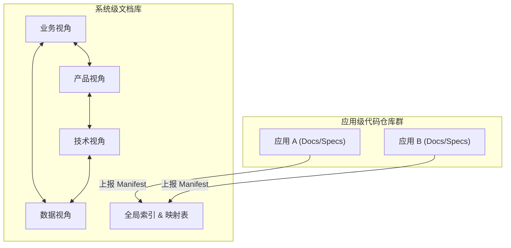

# 全局软件系统知识文档库设计方案 (精简版)

本文档旨在为企业级软件系统构建一套**全面、结构化、可演进**的知识库。本方案去除冗余理论，聚焦于**工程落地**与**核心元数据管理**。

---

## 1. 设计哲学与核心架构

### 1.1 核心原则
1.  **单一事实源 (SSOT)**：每个知识实体（如业务域、API、数据表）仅在一处定义，其他地方通过 ID 引用，杜绝数据不一致。
2.  **联邦治理 (Federated Governance)**：
    *   **系统级仓库 (System Repo)**：集中管理宏观架构（业务域、产品线、系统边界）及跨域关系索引。
    *   **应用级仓库 (App Repo)**：分散管理微观设计（API 接口、数据库 Schema、代码实现），对其负责并向上注册。
3.  **四大视角 (The 4 Views)**：通过**业务、产品、技术、数据**四个维度全方位描述系统，视角间通过显式映射关联。

### 1.2 总体架构图


---

## 2. 目录结构与元模型规范

本方案将**元模型定义**直接融合于**目录结构**中，通过 `_meta.yaml` 文件描述节点属性与关联。

### 2.1 业务视角 (Business View)
*   **定位**：描述业务版图、领域逻辑与规则，不依赖具体技术实现。
*   **层级**：`业务域` -> `子域` -> `限界上下文` -> `聚合`

**目录结构示例**：
```text
01-business/
├── {domain_id}/                  # e.g., BD-ORDER (订单域)
│   ├── _meta.yaml                # 属性: 负责人, 战略分类(Core/Generic)
│   └── {subdomain_id}/           # e.g., BSD-FULFILLMENT (履约子域)
│       ├── _meta.yaml            # 属性: 领域专家
│       └── {context_id}/         # e.g., BC-ORDER-MGMT (订单管理上下文)
│           ├── _meta.yaml        # 属性: 统一语言(Ubiquitous Language)
│           └── aggregates/
│               └── {agg_id}.yaml # e.g., AGG-ORDER.yaml
│                                 # 内容: 聚合根定义, 实体属性, 业务不变量
```

### 2.2 产品视角 (Product View)
*   **定位**：描述产品功能、用户旅程与需求规格。
*   **层级**：`产品线` -> `模块` -> `功能` -> `用例`

**目录结构示例**：
```text
02-product/
├── {line_id}/                    # e.g., PL-ECOMMERCE (电商平台)
│   ├── _meta.yaml                # 属性: 目标用户群, PO
│   └── {module_id}/              # e.g., PM-SHOPPING-CART (购物车模块)
│       ├── _meta.yaml            # 属性: 模块类型(前/中/后台)
│       └── features/
│           └── {feature_id}.yaml # e.g., FT-ADD-TO-CART.yaml
│                                 # 内容: 优先级(P0-P3), 验收标准(AC), 
│                                 # 关联: realizes_use_case_ids
```

### 2.3 技术视角 (Technical View)
*   **定位**：描述系统的物理实现、部署架构与服务接口。
*   **层级**：`系统` -> `应用` -> `微服务`

**目录结构示例**：
```text
03-technical/
├── {system_id}/                  # e.g., SYS-ECOMMERCE-BACKEND
│   ├── _meta.yaml                # 属性: 技术栈概览, 架构风格
│   └── {app_id}.yaml             # e.g., APP-ORDER-SERVICE.yaml
│       # --- 应用注册信息 ---
│       # repo_url: "git@github.com:org/order-service.git"
│       # docs_manifest_path: "/docs/manifest.yaml"  <-- 指向应用级文档入口
│       # service_ids: ["MS-ORDER-COMMAND", "MS-ORDER-QUERY"]
│       # -------------------
```

### 2.4 数据视角 (Data View)
*   **定位**：描述数据存储结构、流向与治理属性。
*   **层级**：`数据存储` -> `数据实体`

**目录结构示例**：
```text
04-data/
├── {store_id}/                   # e.g., DS-ORDER-MYSQL-PRIMARY
│   ├── _meta.yaml                # 属性: 类型(MySQL/Redis), 归属应用ID(app_id)
│   └── schema/
│       └── {entity_id}.yaml      # e.g., ENT-T_ORDER.yaml
│                                 # 内容: 字段定义, 敏感级别(L1-L4)
```

---

## 3. 核心映射机制

为降低维护成本，不再维护独立的“映射矩阵文件”，而是采用**分布式引用**。在源实体的 `_meta.yaml` 或定义文件中通过**目标实体 ID** 建立关联。

| 关系方向 | 源实体 (Source) | 目标实体 (Target) | 关键字段 (Key Field) | 业务含义 |
| :--- | :--- | :--- | :--- | :--- |
| **落地实现** | `Bounded Context` (业务) | `Application` (技术) | `implemented_by_app_id` | 业务上下文由哪个应用代码库实现 |
| **需求支撑** | `Product Module` (产品) | `Bounded Context` (业务) | `relies_on_context_ids` | 产品模块依赖哪些业务能力 |
| **接口实现** | `Feature` (产品) | `API Endpoint` (技术) | `invokes_api_ids` | 功能点调用了哪些具体 API |
| **数据持久化** | `Aggregate` (业务) | `Data Entity` (数据) | `persisted_as_entity_ids` | 领域模型存储在哪张物理表中 |
| **数据归属** | `Data Entity` (数据) | `Microservice` (技术) | `owned_by_service_id` | 谁是该数据的唯一写入方 |

---

## 4. 协同与演进治理

### 4.1 系统级与应用级协同 (Sync Mechanism)
1.  **应用级职责**：
    *   在代码仓库根目录维护 `/docs` 文件夹。
    *   基于代码（Annotation/Comment）自动生成 OpenAPI/AsyncAPI Specs。
    *   生成 `manifest.yaml`，列出当前版本暴露的所有 API、事件及数据库变更。
2.  **系统级职责**：
    *   CI/CD 流水线在应用构建成功后，自动抓取 `manifest.yaml`。
    *   更新 `03-technical/{system}/{app}.yaml` 中的元数据快照。
    *   触发一致性检查（例如：检查 API 变更是否破坏了关联的 Feature 契约）。

### 4.2 架构决策记录 (ADR)
所有跨域、跨系统或影响深远的架构变更，必须在 `00-governance/adr/` 下提交 ADR。
*   **格式**：`ADR-{序号}-{标题}.md`
*   **内容**：背景、决策、后果（正向/负向）、状态（提议/通过/废弃）。

### 4.3 ID 命名规范 (Naming Convention)
所有知识实体必须拥有全局唯一的 ID，推荐格式：`{TYPE}-{NAME}`。
*   `BD-`: 业务域 (Business Domain)
*   `BC-`: 限界上下文 (Bounded Context)
*   `PL-`: 产品线 (Product Line)
*   `FT-`: 功能点 (Feature)
*   `MS-`: 微服务 (Microservice)
*   `DS-`: 数据存储 (Data Store)

---

## 5. 面向未来的演进路线

1.  **阶段一：静态治理（当前）**
    *   建立目录结构，完成核心实体的 ID 化和 YAML 化。
    *   人工维护核心映射关系。
2.  **阶段二：自动化集成**
    *   接入 CI/CD，自动同步应用级元数据。
    *   开发简单的 CLI 工具，校验 ID 引用的有效性。
3.  **阶段三：知识图谱化**
    *   将分散的 YAML 文件导入图数据库（Neo4j）。
    *   提供可视化查询界面，支持“变更影响分析”（例如：修改一个 API，自动列出受影响的功能点）。
