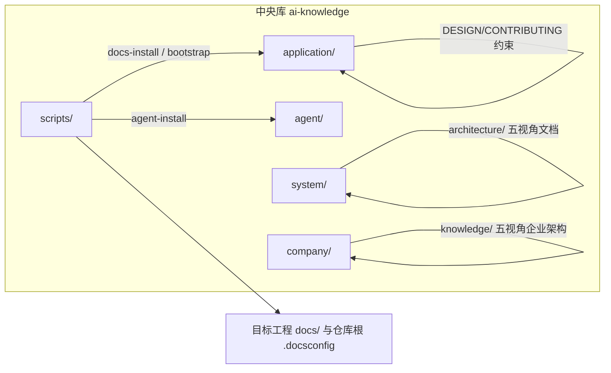
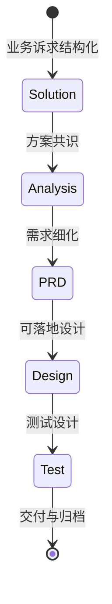

# ai-knowledge 索引指南（index）

> **最后更新**: 2026-06-22  
> **文档定位**: 面向 AI Agent 与维护者的**仓库根全索引目录**；九章结构遵循 `agent/skills/docs-indexing/references/nine-chapter-spec.md`。与 [application/index.md](application/index.md)、[system/index.md](system/index.md) 互为补充时，以本文件为**中央库根路径**落地与检索入口。

---

## 一、项目概览（Project Overview）

### 1.1 速查表

| 组件 | 路径 | 描述 |
| ------ | ------ | ------ |
| 人类入口 | [README.md](README.md) | 克隆、bootstrap、`docs-install`/`agent-install` 与协作总览 |
| 从零落地 | [quick-start.md](quick-start.md) | 场景 A–D 选型与逐步操作（canonical SSOT） |
| Agent 契约 | [AGENTS.md](AGENTS.md) | 角色、索引查阅顺序、提交闸门与禁止事项 |
| 应用侧知识主库 | [application/README.md](application/README.md) | SDD 主线、五视角、实现登记与应用层实体主库 |
| 应用侧索引与建联 | [application/index.md](application/index.md) | 应用目录九章索引、中央知识库挂载建联登记 |
| 系统知识库 | [system/README.md](system/README.md) | `architecture/`（五视角文档）、`application-{name}/` 联邦槽位、`analysis/` |
| 系统侧机器索引 | [system/index.md](system/index.md) | `system/` 树内九章索引（与根、应用侧索引互补） |
| 公司知识库 | [company/README.md](company/README.md) | `knowledge/`（五视角企业架构）、`system-{name}/` 联邦槽位、`changelogs/`、`solutions/`、`analysis/` |
| 初始化脚本 | [scripts/README.md](scripts/README.md) | `docs-install`/`agent-install`/`docs-link`/`docs-bootstrap` |
| 规范与 Slash | [agent/rules/CONVENTIONS.md](agent/rules/CONVENTIONS.md)、[agent/skills/README.md](agent/skills/README.md) | 全局约定与 Skill 清单 |
| 变更与索引运维 | [application/changelogs/README.md](application/changelogs/README.md) | `CHANGE-LOG.md`、`INDEXING-LOG.md` |
| OKF bundle 与校验 | [agent/skills/docs-okf/SKILL.md](agent/skills/docs-okf/SKILL.md) | OKF refresh、validate-okf、viz 与产物校验；与九章 INDEX 双索引并存 |
| OKF 入口 | `/docs-okf` | OKF refresh、校验与可视化（实现归属 `docs-okf`） |

### 1.2 元信息

- **项目名称**: `ai-knowledge`
- **核心定位**: 企业级全局知识底座（Markdown/YAML + Bash 初始化链）；**无业务应用运行时**
- **技术栈**: Markdown、YAML；Bash 5+；Git；可选 `curl`、`rsync`（脚本可回退 `cp`）
- **语言/构建**: 不适用传统应用「启动类」；可运行项为 Bash 脚本与可选 `scripts/tests/run.sh`（见 [scripts/README.md](scripts/README.md)）
- **仓库规模（git 已跟踪）**: 共 **657** 个文件；扩展名约 **503** `.md`、**78** `.sh`、**36** `.json`、**28** `.py`、**3** `.yaml`、**3** `.html`（统计来源：`git ls-files`，2026-06-22）

---

## 二、架构视图（Architecture View）

### 2.1 模块结构

```text
./
├── README.md / AGENTS.md / index.md / quick-start.md  # 人类与 Agent 入口、本索引、从零落地
├── application/                              # 应用侧知识主库：knowledge、阶段、solutions～requirements、changelogs
├── system/                                   # 系统知识库：architecture/（五视角文档）、application-APPNAME/ 联邦槽位、analysis/
├── company/                                  # 公司知识库：knowledge/（五视角企业架构）、system-SYSNAME/ 联邦槽位、changelogs/、solutions/、analysis/
├── scripts/                                  # docs-install、tests/
├── agent/                                    # rules/、skills/（含 docs-okf）、scripts/（config-bootstrap、校验）
├── docs/                                     # 设计备忘与协作产物（superpowers/specs/、plans/）
└── .gitignore                                # 忽略 `.*` 等；见 §八
```

### 2.2 依赖关系



### 2.3 包结构

本仓库非 JVM 工程；以**目录职责**代替包分层：**五视角实体**在 `application/knowledge/`；**治理与命名 SSOT** 在 `agent/knowledge/`；**可执行初始化**在 `scripts/`；**Slash 工作流**在 `agent/skills/<name>/SKILL.md`。

### 2.4 文档目录

- **根索引**: 本文件 [index.md](index.md)
- **应用知识库**: [application/](application/)，详 [application/README.md](application/README.md)；机器索引 [application/index.md](application/index.md)
- **系统知识库树**: [system/](system/)，详 [system/README.md](system/README.md)；机器索引 [system/index.md](system/index.md)
- **运维日志**: [application/changelogs/](application/changelogs/)（`CHANGE-LOG.md`、`INDEXING-LOG.md`）

---

## 三、接口清单（Interface Catalog）

本仓库为**文档与脚本型**仓库，**不提供** HTTP/RPC/消息等运行时接口。

| 小节 | 状态 | 说明 |
| ------ | ------ | ------ |
| 3.1 服务接口 | [未索引] | 无 Dubbo/gRPC 类服务接口 |
| 3.2 HTTP 接口 | [未索引] | 无 REST 路由；对外「契约」体现为文档与脚本 CLI |
| 3.3 定时任务 | [未索引] | 无内嵌调度；CI 若存在由外部平台配置，未纳入本索引 |
| 3.4 消息队列 | [未索引] | 无 Topic/消费者 |

---

## 四、领域模型（Domain Model）

### 4.1 业务术语

| 术语 | 定义 | 使用场景 |
| ------ | ------ | ---------- |
| SSOT | 单一事实源，`application/` 为应用知识稳定事实中枢 | 与联邦镜像、目标工程对齐 |
| 五视角 | 业务 / 产品 / 应用 / 数据 / 技术 知识分层与映射字段 | 见 [application/DESIGN.md](application/DESIGN.md) |
| 联邦治理 | `system/`、`company/` 槽位与迁移叙事；`system/application-{name}/` 为应用镜像，`company/system-{name}/` 为系统镜像 | 多库协作与 docs-install 模式 |
| SDD | 方案 → 分析 → PRD/设计/测试 阶段交付链 | `sdx-*` Skill 与 `application/` 阶段目录 |
| 中央知识库挂载建联 | `docs-install --mode=central` 等约定 | 见 [README.md](README.md)、[scripts/README.md](scripts/README.md) |
| 五架构视角 | 业务 / 产品 / 应用 / 技术 / 数据 架构文档体系；`system/knowledge/` 与 `company/knowledge/` 均按此组织 | docs-distill、docs-archive、overview 文件 |

### 4.2 聚合根（知识组织）

| 聚合 | 职责 | 关键落点 |
| ------ | ------ | ---------- |
| 治理规则 | 术语、原则、命名、ADR 模板 | [agent/knowledge/knowledge-governance.md](agent/knowledge/knowledge-governance.md)、[agent/knowledge/README.md](agent/knowledge/README.md) |
| 五视角实体 | BC/AGG、PL/PM/FT/UC、SYS/APP/MS、DS/ENT、MW/CMP 等 | [application/knowledge/](application/knowledge/) |
| 阶段产物 | SOLUTION / ANALYSIS / REQUIREMENT 包 | `application/solutions/` 等 |

### 4.3 领域服务（协作能力）

| 能力 | 功能 | 依赖 |
| ------ | ------ | ------ |
| Slash Skills | 文档索引、变更聚合、SDD 各阶段、归档等 | `agent/skills/*/SKILL.md` |
| 初始化链 | 拷贝知识库、写 `.docsconfig`、安装 Agent 文件 | `scripts/*.sh`、`agent/scripts/docs-core.sh` |

### 4.4 领域事件

无运行时领域事件；**维护性事件**见 [application/changelogs/CHANGE-LOG.md](application/changelogs/CHANGE-LOG.md)（docs-change）与 [application/changelogs/INDEXING-LOG.md](application/changelogs/INDEXING-LOG.md)（docs-indexing）。

---

## 五、业务逻辑（Business Logic）

### 5.1 状态流转（SDD 阶段）



具体推进协议与写作约束见各 `sdx-*` Skill 与 [application/CONTRIBUTING.md](application/CONTRIBUTING.md)。

### 5.2 核心流程

1. **从零选型与落地**: 读 [quick-start.md](quick-start.md) 选场景 A–D，再按 [scripts/README.md](scripts/README.md) 执行 bootstrap / install。
2. **目标工程接入知识库**: `git clone` 或 `docs-bootstrap.sh` → `./scripts/docs-install.sh --target=...`（可选 `--mode=central`、`--scope`、`--type`）。
3. **仅安装 Agent 配置**: `./scripts/agent-install.sh`（`--target`、`--agents`、`--scope` 等）。
4. **维护索引与变更**: `/docs-indexing` 更新根 `index.md`；`/docs-change` 更新 [application/changelogs/CHANGE-LOG.md](application/changelogs/CHANGE-LOG.md)。
5. **OKF refresh 与校验**: `/docs-okf`（实现与内部命令见 [agent/skills/docs-okf/references/workflow.md](agent/skills/docs-okf/references/workflow.md)）。
6. **知识工程**: `/docs-build` 等按 [agent/skills/README.md](agent/skills/README.md) 执行。

### 5.3 业务规则（协作）

| 规则来源 | 描述 |
| ---------- | ------ |
| [AGENTS.md](AGENTS.md) | 禁止擅自改实体 ID、未确认不 `git commit`、文档产出闸门 |
| [application/CONTRIBUTING.md](application/CONTRIBUTING.md) | 贡献流程与阶段规则 |
| [agent/rules/CONVENTIONS.md](agent/rules/CONVENTIONS.md) | 全局命名与交付约定 |

### 5.4 枚举与模式（初始化）

| 名称 | 取值 | 说明 |
| ------ | ------ | ------ |
| `docs-install --mode` | `standalone` / `central`（中央知识库挂载建联） | 见 [scripts/README.md](scripts/README.md) 功能概述表 |
| `docs-install --scope` | `config` / `knowledge` | 默认 `k`（knowledge）；`knowledge` 不处理 `.docsconfig` |
| `docs-install --type` | `application` / `system` / `company` | 与 `scope=knowledge` 组合 |

---

## 六、数据映射（Data Mapping）

### 6.1 数据源

| 数据源 | 类型 | 用途 |
| -------- | ------ | ------ |
| `application/knowledge/**/*.yaml` 等 | YAML 元数据与实体 | 五视角实体与关系 |
| `{ID}.md` / `*-meta.md` | Markdown | OKF 概念实体与视角元数据，见各视角目录 |
| Git 仓库 | 文本与脚本 | 版本与协作真相源 |

### 6.2 实体映射

映射字段与层级见 [application/DESIGN.md](application/DESIGN.md)、[agent/knowledge/glossary.md](agent/knowledge/glossary.md)（如 `implemented_by_app_id`、`persisted_as_entity_ids` 等）；**禁止**在未同步引用链时改实体 ID（见 [AGENTS.md](AGENTS.md)）。

### 6.3 关系映射

跨视角引用通过 **ID 与 YAML 字段**维护；详 [application/knowledge/README.md](application/knowledge/README.md)、[application/knowledge/index.md](application/knowledge/index.md)。

### 6.4 SQL 索引

[未索引] 本仓库不包含应用数据库表结构；数据持久化指**文件化知识实体**，非 RDBMS 表。

---

## 七、配置中心（Configuration Hub）

### 7.1 配置项（节选）

| 配置项/参数 | 所在位置 | 说明 |
| ------------- | ---------- | ------ |
| `GIT_REPO_URL` / `GIT_REF` | [scripts/docs-bootstrap.sh](scripts/docs-bootstrap.sh) | bootstrap 克隆地址与引用（可环境变量覆盖） |
| `REPO_ROOT`（环境变量） | [scripts/docs-install.sh](scripts/docs-install.sh) 等 | 指向**本中央库**根目录（运行脚本时） |
| `--target` | `docs-install.sh` | 目标工程文档目录，**必填** |
| `--mode` / `--scope` / `--type` / `--force` / `--dry-run` | `docs-install.sh` | 见 [scripts/README.md](scripts/README.md) |
| `.docsconfig` 键 | 目标工程仓库根 | `DOC_ROOT`、`REPO_ROOT`、`DOC_DIR`、`KNOWLEDGE_TYPE`；可选 `AGENT_*`（`agent-install`）；OKF 路径解析见 [agent/skills/docs-okf/scripts/resolve-okf-paths.sh](agent/skills/docs-okf/scripts/resolve-okf-paths.sh) |
| OKF refresh / 校验 | `/docs-okf` | 公开入口；内部实现位于 `agent/skills/docs-okf/scripts/` |

### 7.2 环境差异

| 维度 | standalone | central（中央知识库挂载建联） |
| ------ | ------------ | ------------------------------- |
| 同步范围 | 按 type 全量或组织/公司模板 | `application/` 子集为主（见 scripts 功能表） |
| 登记行为 | 标准拷贝 | 另涉及主库登记与联邦路径（见脚本说明） |

### 7.3 敏感信息

`.docsconfig` 与密钥**不应**提交到公开仓库；文档中只描述**键名与语义**，不写入真实密钥（见 [AGENTS.md](AGENTS.md) 安全习惯）。

---

## 八、索引边界（Index Boundary）

### 8.1 覆盖范围

| 类型 | 数量（已跟踪） | 描述 |
| ------ | ---------------- | ------ |
| 全库文件 | 657 | `git ls-files` 2026-06-22 |
| Markdown | 503 | 主体文档、OKF concept 与 Skill |
| Shell | 78 | 初始化、OKF 与测试脚本 |
| JSON | 36 | 评测与知识提取等 |
| Python | 28 | 钩子、OKF 与辅助脚本 |
| YAML | 3 | 元数据与 knowledge-links |
| HTML | 3 | OKF viz 等 |

精读依据：`agent/skills/docs-indexing/references/scan-spec.md` 深度 3；本索引正文整合自**已读**入口文件与仓库统计，非逐文件全文摘录。

### 8.2 排除列表

| 模式 | 原因 |
| ------ | ------ |
| `.git/` | 版本控制元数据 |
| `node_modules/`、`target/`、`build/` | 依赖与构建产物（scan-spec） |
| 被 `.gitignore` 忽略的 `.*` 等 | 如 `.cursor` 工作区缓存通常未入库；以 `git ls-files` 为准 |

### 8.3 维护规则

- **触发**: 大目录调整、Skill/脚本契约变更、联邦路径变更后执行 `/docs-indexing`。
- **增量前提**: `application/changelogs/INDEXING-LOG.md` 主表**第一行** `indexing_finished_ms` 为时间锚点（迁移期可回退文内 `<!-- sdx-indexing:indexing_finished_ms=... -->`）；显式 `--since` 优先生效。详见 `agent/skills/docs-indexing/references/indexing-log-spec.md`。
- **联动**: 与 `/docs-change` 共用 `application/changelogs/` 下运维文件。

---

## 九、扩展资源（Extended Resources）

### 9.1 核心文档

| 文档 | 路径 | 描述 |
| ------ | ------ | ------ |
| 全局查阅顺序 | [index.md](index.md)（本文件） | 根目录九章地图 |
| 从零落地 | [quick-start.md](quick-start.md) | 场景 A–D 操作 SSOT |
| 应用侧九章与建联 | [application/index.md](application/index.md) | `application/` 树内九章索引与中央建联登记 |
| 系统知识库入口 | [system/README.md](system/README.md) | 五视角架构文档、联邦槽位、analysis/ |
| 系统侧九章索引 | [system/index.md](system/index.md) | `system/` 树内九章索引 |
| 公司知识库入口 | [company/README.md](company/README.md) | knowledge/ 五视角企业架构、system-{name}/ 槽位、changelogs/ |
| 设计原则 | [application/DESIGN.md](application/DESIGN.md) | 元模型与演进 |
| 贡献流程 | [application/CONTRIBUTING.md](application/CONTRIBUTING.md) | 阶段与模板指针 |

### 9.2 相关项目

| 项目 | 关系 | 描述 |
| ------ | ------ | ------ |
| oleewen/ai-knowledge | 上游 | 中央库本仓库 |
| 目标工程 `docs/` | 下游 | 由 `docs-install` 注入内容 |

### 9.3 工具链与 Skill 清单

| 工具 | 版本/说明 | 用途 |
| ------ | ----------- | ------ |
| Bash | 5+ | 脚本运行环境 |
| Git | 当前环境 | 版本控制；`git ls-files` 枚举 |
| Slash Skills | 见下表 | Agent 工作流 |

| 命令 | 目录 |
| ------ | ------ |
| `/docs-indexing` | [agent/skills/docs-indexing/SKILL.md](agent/skills/docs-indexing/SKILL.md) |
| `/docs-agent` | [agent/skills/docs-agent/SKILL.md](agent/skills/docs-agent/SKILL.md) |
| `/docs-build` | [agent/skills/docs-build/SKILL.md](agent/skills/docs-build/SKILL.md) |
| `/docs-change` | [agent/skills/docs-change/SKILL.md](agent/skills/docs-change/SKILL.md) |
| `/docs-tag` | [agent/skills/docs-tag/SKILL.md](agent/skills/docs-tag/SKILL.md) |
| `/docs-pull` | [agent/skills/docs-pull/SKILL.md](agent/skills/docs-pull/SKILL.md) |
| `/docs-distill` | [agent/skills/docs-distill/SKILL.md](agent/skills/docs-distill/SKILL.md) |
| `/docs-extract` | [agent/skills/docs-extract/SKILL.md](agent/skills/docs-extract/SKILL.md) |
| `/docs-archive` | [agent/skills/docs-archive/SKILL.md](agent/skills/docs-archive/SKILL.md) |
| `/docs-upgrade` | [agent/skills/docs-upgrade/SKILL.md](agent/skills/docs-upgrade/SKILL.md) |
| `/docs-okf` | [agent/skills/docs-okf/SKILL.md](agent/skills/docs-okf/SKILL.md)（[workflow](agent/skills/docs-okf/references/workflow.md)、[path-resolution](agent/skills/docs-okf/references/path-resolution.md)） |
| `/sdx-solution` | [agent/skills/sdx-solution/SKILL.md](agent/skills/sdx-solution/SKILL.md) |
| `/sdx-analysis` | [agent/skills/sdx-analysis/SKILL.md](agent/skills/sdx-analysis/SKILL.md) |
| `/sdx-prd` | [agent/skills/sdx-prd/SKILL.md](agent/skills/sdx-prd/SKILL.md) |
| `/sdx-architect` | [agent/skills/sdx-architect/SKILL.md](agent/skills/sdx-architect/SKILL.md) |
| `/sdx-design` | [agent/skills/sdx-design/SKILL.md](agent/skills/sdx-design/SKILL.md)（[gates](agent/skills/sdx-design/references/gates.md)、[workflow](agent/skills/sdx-design/references/workflow.md)、[evals](agent/skills/sdx-design/evals/evals.json)） |
| `/sdx-test` | [agent/skills/sdx-test/SKILL.md](agent/skills/sdx-test/SKILL.md)（[gates](agent/skills/sdx-test/references/gates.md)、[workflow](agent/skills/sdx-test/references/workflow.md)、[evals](agent/skills/sdx-test/evals/evals.json)） |
| `/skill-creator` | [agent/skills/skill-creator/SKILL.md](agent/skills/skill-creator/SKILL.md) |

---

**索引元数据**: 本次运行 **mode=full**，**depth=3**，**since_ms=0**（全量），输出 **./index.md**；运行记录见 [application/changelogs/INDEXING-LOG.md](application/changelogs/INDEXING-LOG.md)（2026-06-22 四域 full d3）。
