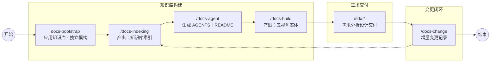
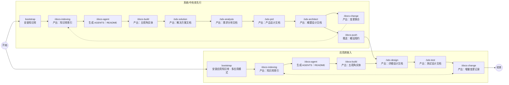
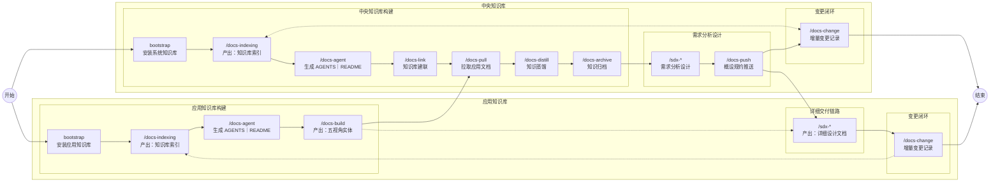
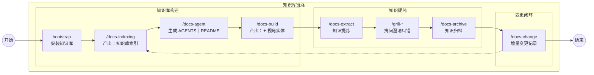

# 从零起步构建知识库

> **定位**：落地操作指南（canonical SSOT）。概念与元模型见 [README.md](README.md)、各层 [application/DESIGN.md](application/DESIGN.md)。

---

## 选型

**口诀**：有应用仓 → 先 bootstrap + build；有多应用 → 中央 link + pull/distill；只有 legacy → extract → archive → build。

| 场景 | 适用 | 一句话 |
| --- | --- | --- |
| **A** | 单一应用，无联邦 | 应用仓 standalone，建 SSOT + 按需 SDD |
| **B** | 新系统（多应用）+ 中央库 | 先系统库需求/概设，再应用库详设与开发 |
| **C** | 老系统（多应用）+ 中央库 | 先各应用 SSOT，再中央 pull/distill/archive |
| **D** | 仅有 Wiki/协作文档等 legacy | overview 缓冲区 → archive → build |

脚本参数与 mode 详见 [scripts/README.md](scripts/README.md)。

---

## 场景 A：独立应用系统

**目标**：在单一应用仓建立 SSOT，无需系统/公司联邦。

| 步骤 | 动作 | 产出 |
| --- | --- | --- |
| 1 | `docs-bootstrap` 安装应用知识库（`--mode=standalone`，`--type=application`） | 应用 `/docs` 骨架 + `.docsconfig` + Agent |
| 2 | `/docs-indexing`（完成 spec 与 gate 确认）+ `/docs-agent` | `INDEX_GUIDE.md`、`README.md`、`AGENTS.md` |
| 3 | `/docs-build` | 四视角实体、`KNOWLEDGE_INDEX.md` |
| 4 | 需求交付链路按需：`/sdx-solution` → … → `/sdx-architect` → `/sdx-design` → `/sdx-test` | `SOLUTION` … `DSD`、`TDD` |
| 5 | `/docs-change` + 定期 `/docs-indexing` | 变更可追溯 |

---

## 场景 B：新系统（多应用）+ 中央知识库

**目标**：系统/公司库承载需求与概设 SSOT，应用库承接规约落地与变更闭环。

### 阶段一：从系统知识库入手，完成需求分析设计

| 步骤 | 动作 | 产出 |
| --- | --- | --- |
| 1 | `docs-bootstrap` 安装系统/公司知识库（`--type=system` 或 `company`） | `/docs` 骨架 + `.docsconfig` + Agent |
| 2 | `/docs-indexing`（完成 spec 与 gate 确认）+ `/docs-agent` | `INDEX_GUIDE.md`、`README.md`、`AGENTS.md` |
| 3 | 需求分析设计链路：`/sdx-solution` → `/sdx-analysis` → `/sdx-prd` → `/sdx-architect` | `SOLUTION`、`ANALYSIS`、`PRD`、`ASD`、`spec-asd` |

### 阶段二：安装应用知识库，同步概设规约，详设与规约开发

| 步骤 | 动作 | 产出 |
| --- | --- | --- |
| 1 | `docs-bootstrap` 安装应用知识库 + `docs-link` 与系统/中央库建联 | 应用 `/docs` + 联邦登记 |
| 2 | `/docs-push` 推送概设规约（`spec-asd`）到应用库 | 应用仓 `requirements/**/specs/` |
| 3 | 规约详细设计链路：`/sdx-design` → `/sdx-test` | `DSD`、`TDD` |
| 4 | 规约开发实现链路：`brainstorming` → `opsx:*` → `superpowers:sdd` | 代码实现 + 规格归档 |
| 5 | `/docs-build`（按需） | 四视角实体、`KNOWLEDGE_INDEX.md` |

应用库 **mode**：**standalone** 单应用全量模板；**central** 仅同步 `knowledge/`、`changelogs/` 等子集并与系统库 `docs-link` 建联（见 [scripts/README.md](scripts/README.md)）。

### 阶段三：聚合变更到应用知识库

| 步骤 | 动作 | 产出 |
| --- | --- | --- |
| 1 | `/docs-change` | 变更聚合至 `changelogs/` |
| 2 | `/docs-indexing`（增量，完成 gate 确认） | `INDEX_GUIDE.md` 与变更对齐、可追溯 |

---

## 场景 C：老系统（多应用）+ 中央知识库

**目标**：先在各现存应用落地知识库 SSOT，再建中央/系统库聚合上行，接续增量需求分析与规约开发。

### 阶段一：现存应用构建知识库

| 步骤 | 动作 | 产出 |
| --- | --- | --- |
| 1 | 各现存应用 `docs-bootstrap` 安装知识库（`--mode=standalone` 或 `central`） | 应用 `/docs` 骨架 + `.docsconfig` + Agent |
| 2 | `/docs-indexing`（完成 spec 与 gate 确认）+ `/docs-agent` | `INDEX_GUIDE.md`、`README.md`、`AGENTS.md` |
| 3 | `/docs-extract` 从 Wiki / 协作文档 / 代码注释等 legacy 源提炼（按需） | 应用侧结构化草稿或 overview 素材 |
| 4 | `/docs-build` | 各应用四视角实体、`KNOWLEDGE_INDEX.md` |
| 5 | `/docs-change` | 变更聚合至各应用 `changelogs/` |

### 阶段二：新建系统知识库，登记已有应用，拉取镜像并蒸馏归档

| 步骤 | 动作 | 产出 |
| --- | --- | --- |
| 1 | 克隆 `ai-knowledge` 作为中央库；`docs-bootstrap` 安装系统/公司知识库 | 中央 `/docs` 骨架 + `.docsconfig` + Agent |
| 2 | `/docs-indexing`（完成 spec 与 gate 确认）+ `/docs-agent` | `INDEX_GUIDE.md`、`README.md`、`AGENTS.md` |
| 3 | `docs-link` 登记各已有应用库（`--link --target=… --app_name=…`） | `knowledge-links.yaml`（`repository` + `path` + `doc_dir` + `app_name`） |
| 4 | `/docs-pull` 拉取各应用联邦镜像 | `system/application-{APPNAME}/` |
| 5 | `/docs-distill --app {APPNAME}`（配合 `--since` 增量） | `system/knowledge/overview/{APPNAME}-overview.md` 第三列 |
| 6 | `/docs-archive`（人工核实高优先级行后） | 知识落入 `system/knowledge/` 各视角章节 |

### 阶段三：接续系统知识库需求分析、概要设计

| 步骤 | 动作 | 产出 |
| --- | --- | --- |
| 1 | 需求分析设计链路：`/sdx-solution` → `/sdx-analysis` → `/sdx-prd` → `/sdx-architect` | `SOLUTION`、`ANALYSIS`、`PRD`、`ASD`、`spec-asd` |

### 阶段四：应用知识库详设、规约开发，变更聚合

| 步骤 | 动作 | 产出 |
| --- | --- | --- |
| 1 | `/docs-push` 推送概设规约（`spec-asd`）到各应用库 | 应用仓 `requirements/**/specs/` |
| 2 | 规约详细设计链路：`/sdx-design` → `/sdx-test` | `DSD`、`TDD` |
| 3 | 规约开发实现链路：`brainstorming` → `opsx:*` → `superpowers:sdd` | 代码实现 + 规格归档 |
| 4 | `/docs-change` + 定期 `/docs-pull` + `/docs-distill --since` | 应用变更可追溯，联邦镜像与系统视图增量对齐 |
| 5 | `/docs-indexing`（增量，完成 gate 确认） | 中央与应用 `INDEX_GUIDE.md` 一致 |

---

## 场景 D：从现存文档抽取结构化知识库

**目标**：仅有 Wiki / 协作文档等 legacy 散落知识；以 overview 为缓冲区，低成本抽取为 SSOT。

### 阶段一：安装知识库，文档源盘点并抽取入 overview

| 步骤 | 动作 | 产出 |
| --- | --- | --- |
| 1 | `docs-bootstrap` 安装应用或系统/公司知识库 | `/docs` 骨架 + `.docsconfig` + Agent |
| 2 | `/docs-indexing`（完成 spec 与 gate 确认）+ `/docs-agent` | `INDEX_GUIDE.md`、`README.md`、`AGENTS.md` |
| 3 | 复制 overview 模板，盘点源（Wiki / Confluence / Word / 代码注释等） | `{APPNAME}-overview.md` 骨架 |
| 4 | `/docs-extract` 段落筛选提炼入第三列 | overview 第三列草稿 |

### 阶段二：核实归档并构建四视角实体

| 步骤 | 动作 | 产出 |
| --- | --- | --- |
| 1 | 人工核实高优先级行（先术语与边界，再流程与接口） | 可归档条目 |
| 2 | `/docs-archive` | 知识落入 `architecture/` 各视角章节 |
| 3 | `/docs-build` | 四视角实体、`KNOWLEDGE_INDEX.md` |

> **原则**：先 overview 缓冲区，再 archive，再 entity — 不要一步到位硬造 YAML。overview 与归档约定见 [system/DESIGN.md](system/DESIGN.md)。

### 阶段三：聚合变更，按需接续需求交付

| 步骤 | 动作 | 产出 |
| --- | --- | --- |
| 1 | `/docs-change` | 变更聚合至 `changelogs/` |
| 2 | `/docs-indexing`（增量，完成 gate 确认） | `INDEX_GUIDE.md` 与变更对齐 |
| 3 | 需求交付链路按需：`/sdx-solution` → … → `/sdx-architect` → `/sdx-design` → `/sdx-test` | `SOLUTION` … `DSD`、`TDD` |

---

## 相关文档

| 需求 | 文档 |
| --- | --- |
| 流程总览图 | [README.md](README.md#-agent-工作流与推荐流程) |
| 元模型与实体层级 | [application/DESIGN.md](application/DESIGN.md)、[system/DESIGN.md](system/DESIGN.md)、[company/DESIGN.md](company/DESIGN.md) |
| 初始化脚本 | [scripts/README.md](scripts/README.md) |
| Skill 清单 | [agent/skills/README.md](agent/skills/README.md) |
