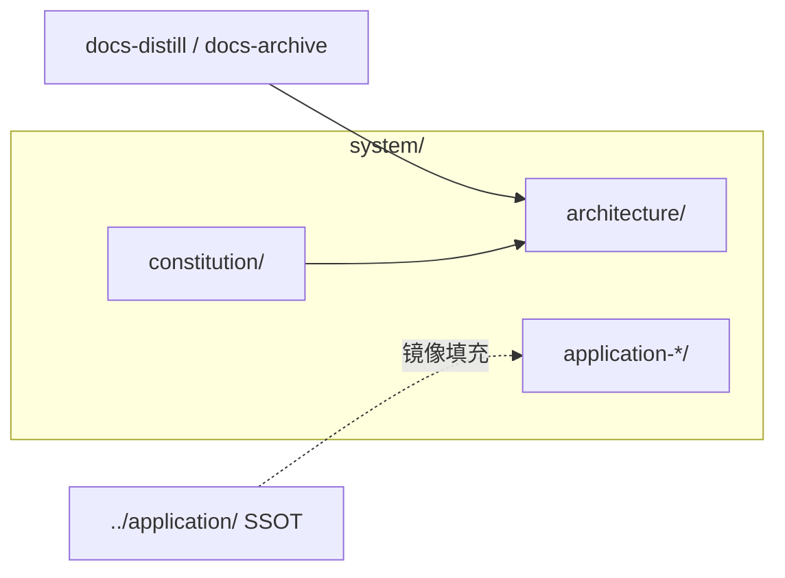

# system 索引指南（INDEX_GUIDE）

> **最后更新**: 2026-05-05  
> **文档定位**: 面向 AI Agent 的 **`system/` 文档根**九章机器索引；描述系统知识库、五视角架构文档与 **`application-{name}/`** 联邦槽位。应用层 SSOT 仍在 [../application/](../application/)。

---

## 一、项目概览（Project Overview）

### 1.1 速查表

| 组件 | 路径 | 描述 |
|------|------|------|
| 系统库人类入口 | [README.md](README.md) | 子目录表、架构文档阅读顺序 |
| 架构总览 | [architecture/OVERVIEW.md](architecture/OVERVIEW.md) | 一页纸、视角关系、治理与 FAQ |
| 五视角架构目录 | [architecture/README.md](architecture/README.md) | 业务/产品/应用/数据/技术 分视角 README |
| 联邦应用槽位 | [application-APPNAME/README.md](application-APPNAME/README.md) | 占位模板；真实应用名替换 `APPNAME` |
| 系统宪法 | [constitution/README.md](constitution/README.md) | 与 `application/constitution/` 职责边界见该 README |
| 联邦建联 | [knowledge-links.yaml](knowledge-links.yaml) | 与中央库/应用镜像的链接登记（按项目约定维护） |
| 运维日志 | [changelogs/README.md](changelogs/README.md) | `CHANGE-LOG.md`、**本根** `INDEXING-LOG.md` |
| 仓库根全索引 | [../INDEX_GUIDE.md](../INDEX_GUIDE.md) | 中央库根路径九章地图 |
| 应用侧索引 | [../application/INDEX_GUIDE.md](../application/INDEX_GUIDE.md) | 应用 `DOC_DIR` 机器索引 |

### 1.2 元信息

- **目录角色**: **系统知识库** — 组织级架构叙事、`system/architecture/` 五视角终稿、`application-{name}/` 镜像槽位
- **技术栈**: Markdown、YAML（元数据与链接登记）
- **已跟踪文件规模**（仅 `system/` 前缀）: **73** 个文件（`git ls-files system/`，2026-05-05）
- **精读深度**: 本轮 **depth=3**（已读 README、architecture 索引与目录枚举）

---

## 二、架构视图（Architecture View）

### 2.1 模块结构

```text
system/
├── README.md / INDEX_GUIDE.md / DESIGN.md / docs_meta.yaml
├── knowledge-links.yaml
├── constitution/                 # 系统级宪法与治理
├── architecture/                 # 五视角 + overview/ 蒸馏占位
│   ├── OVERVIEW.md / ARCHITECTURE-OVERVIEW.md
│   ├── business/ product/ application/ data/ technical/
│   └── overview/NAME-overview.md
├── application-APPNAME/          # 联邦槽位（示例名 APPNAME）
├── analysis/                     # 系统侧分析占位
├── requirements/                 # 需求树占位与 EXAMPLE
├── solutions/                    # 方案阶段占位
└── changelogs/                   # 变更与索引日志（本根）
```

### 2.2 依赖关系



### 2.3 包结构

非代码包分层；以 **architecture 子目录** 对应五视角文档树。

### 2.4 文档目录

- **架构入口**: [architecture/README.md](architecture/README.md)  
- **总览**: [architecture/OVERVIEW.md](architecture/OVERVIEW.md)  
- **公司侧对照**: [../company/architecture/README.md](../company/architecture/README.md)

---

## 三、接口清单（Interface Catalog）

| 小节 | 状态 | 说明 |
|------|------|------|
| 3.1～3.4 | [未索引] | 无运行时服务接口；契约为文档与初始化脚本 CLI |

---

## 四、领域模型（Domain Model）

### 4.1 业务术语

| 术语 | 定义 |
|------|------|
| 五视角架构 | 业务、产品、应用、数据、技术 架构文档体系 |
| 联邦槽位 | `application-{name}/` 承载从应用库 fetch 的镜像内容 |
| 蒸馏入口 | `architecture/overview/*-overview.md` 与 docs-distill 技能对齐 |

### 4.2 聚合

| 聚合 | 职责 | 路径 |
|------|------|------|
| 架构正文 | 可评审架构叙事 | [architecture/](architecture/) |
| 槽位 | 应用联邦镜像 | `application-*/` |
| 链接登记 | 建联元数据 | [knowledge-links.yaml](knowledge-links.yaml) |

### 4.3 领域服务

| 能力 | 说明 |
|------|------|
| docs-distill | 自 `system/application-*/` 核实内容上行至 `architecture/overview/` |
| docs-archive | 与 overview 行级副标题文件对齐（见根索引 Skill 表） |

### 4.4 领域事件

见 [changelogs/CHANGE-LOG.md](changelogs/CHANGE-LOG.md)、[changelogs/INDEXING-LOG.md](changelogs/INDEXING-LOG.md)。

---

## 五、业务逻辑（Business Logic）

### 5.1 阅读顺序（摘自 README）

1. [architecture/OVERVIEW.md](architecture/OVERVIEW.md)  
2. 业务 / 产品视角文档  
3. 应用 / 数据 / 技术视角文档  

### 5.2 核心流程

1. 从 [README.md](README.md) 进入并按架构表跳转。  
2. 维护 `overview/` 与五视角文档时遵循 [../agent/rules/design/design-guidelines.md](../agent/rules/design/design-guidelines.md) 与 distill/archive 技能闸门。  
3. 更新本索引：对 `system/` 执行 `/docs-indexing`（与根、应用参数独立确认）。

### 5.3 规则来源

| 来源 | 要点 |
|------|------|
| [constitution/README.md](constitution/README.md) | 系统与应用宪法边界 |
| [../AGENTS.md](../AGENTS.md) | 全局 Agent 契约 |

---

## 六、数据映射（Data Mapping）

### 6.1 数据源

| 数据源 | 类型 | 用途 |
|--------|------|------|
| `architecture/**/*.md` | Markdown | 架构事实与模板段 |
| `*_meta.yaml` | YAML | 目录元数据 |
| `knowledge-links.yaml` | YAML | 联邦链接 |

### 6.2～6.4

无应用数据库表；SQL 类 **[未索引]**。

---

## 七、配置中心（Configuration Hub）

### 7.1 配置项

| 项 | 位置 |
|----|------|
| 文档元数据 | [docs_meta.yaml](docs_meta.yaml)、[changelogs/changelogs_meta.yaml](changelogs/changelogs_meta.yaml) |

### 7.2 环境差异

内容随「中央库 vs 目标工程联邦副本」变化；以 [README.md](README.md) 与根 [scripts/README.md](../scripts/README.md) 为准。

### 7.3 敏感信息

镜像路径可能含本机绝对路径；登记表勿提交无关隐私。

---

## 八、索引边界（Index Boundary）

### 8.1 覆盖范围

| 指标 | 值 |
|------|-----|
| `git ls-files system/` | 73 |
| 本轮 mode / depth | `full` / `3` |

### 8.2 排除

- `../application/` 内四视角实体细节见应用索引。  
- 未跟踪构建产物 **[未索引]**。

### 8.3 维护规则

- 本根 **`system/changelogs/INDEXING-LOG.md`** 记录对 **`system/INDEX_GUIDE.md`** 的索引运行（与 `application/changelogs` 中根/应用索引行分列）。

---

## 九、扩展资源（Extended Resources）

### 9.1 核心文档

| 文档 | 路径 |
|------|------|
| 公司架构对照 | [../company/architecture/README.md](../company/architecture/README.md) |
| docs-distill | [../agent/skills/docs-distill/SKILL.md](../agent/skills/docs-distill/SKILL.md) |

### 9.2 视角文件索引（architecture/）

与 [architecture/README.md](architecture/README.md) 中表格一致，含 `BUSINESS-ARCHITECTURE.md`、`PRODUCT-ARCHITECTURE.md`、`APPLICATION-ARCHITECTURE.md`、`DATA-ARCHITECTURE.md`、`TECHNICAL-ARCHITECTURE.md` 等；不在此重复全表以避免漂移。

---

**索引元数据**: 本次运行 **mode=full**，**depth=3**，**since_ms=0**，输出 **system/INDEX_GUIDE.md**；运行记录见 [changelogs/INDEXING-LOG.md](changelogs/INDEXING-LOG.md)。
