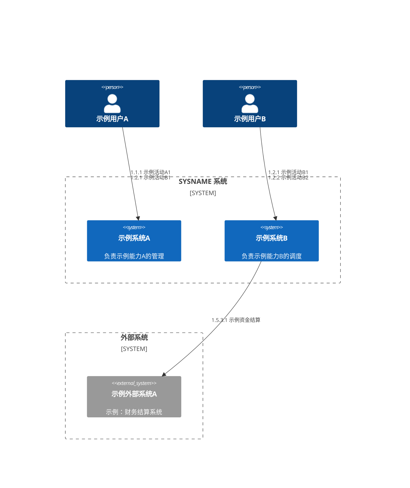

# 应用架构

[返回上一级 · 应用架构目录](README.md)

本节说明本系统的应用结构、职责边界与分层演进，为服务设计与集成提供上层蓝图。

> **应用架构 SSOT**：公司级 C4、分层与演进标准见 [`application-architecture.md`](../../../company/ea/application/application-architecture.md)。

## 系统上下文

<!-- **应写内容**：本系统与用户、外部系统、第三方服务之间的边界与主要交互；信任边界与数据出入方向。命名与 [`business-glossary.md`](../business/business-glossary.md)、集成清单一致。 -->

<!-- **产出建议**：C4 L1 图（PlantUML、Mermaid 或配图）；图下列出主要外部依赖与协议类型。 -->

以下为系统域 **C4 Context**（人物与系统关系上的标注为业务流程编码 `a.b.c` 或活动编码 `a.b.c.d`）。

## 职责边界

<!-- **应写内容**：每个应用或逻辑服务的名称、职责、负责人、生命周期状态（在建/运行/下线）；与业务能力或业务域的映射。避免职责重叠或「万能服务」无边界。 -->

<!-- **产出建议**：服务清单表（可含仓库、语言、关键 SLA）；与 [`business-capability-map.md#系统映射`](../business/business-capability-map.md#系统映射) 交叉引用。 -->

| 系统名称 | 主要职责 | 边界说明 |
| -------- | -------- | -------- |
| **示例系统A** | 示例：XX。 | 示例：XX。 |

## 服务能力矩阵

| 业务流程组/流程/活动 | 归属系统 | 能力说明 | SLA 协议 |
| -------------------- | -------- | -------- | -------- |
| 1.1.1.1 示例活动 | 示例系统A | 示例：XX。入参：IN。出参：OUT。 | -- |

## 分层结构

<!-- **应写内容**：分层模型（如渠道层、核心域服务、共享能力、支撑后台）及各层职责；跨层调用规则与禁止项。若采用领域或产品线划分，说明与分层的正交关系。区分前端、后端。 -->

<!-- **产出建议**：分层示意图 + 简短文字；可选「服务—分层」矩阵。 -->

## 演进路线

<!-- **应写内容**：从中短期到长期的演进阶段、里程碑与触发条件；每阶段的主要风险与回滚策略；与项目/产品路线图的关系。标注「当前态 / 过渡态 / 目标态」。 -->

<!-- **产出建议**：时间线或阶段表；关键里程碑与责任团队；链至 [`product-overview.md#产品路线`](../product/product-overview.md#产品路线)。 -->
