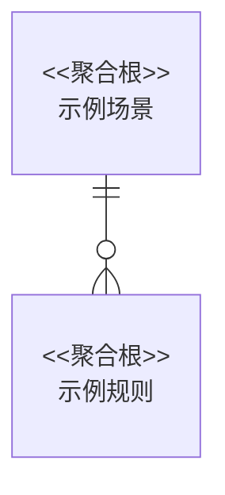
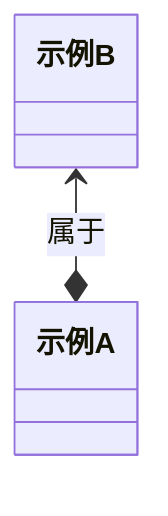

# 领域模型

[返回上一级 · 应用架构目录](README.md)

本节给出本系统的模型：聚合/实体边界、UML 类图及关键属性，供服务实现与评审。

> **领域模型 SSOT**：公司级建模标准见 [`application-domain-model.md`](../../../company/ea/application/application-domain-model.md)。

与 [业务架构 — 概念模型](../business/business-glossary.md#概念模型) 及 [数据架构 — 逻辑/物理模型](../data/data-model.md) 交叉对齐。

## 领域模型

## 对象模型

## 对象定义

| 领域对象 | 对象类型 | 关键属性 |
| --- | --- | --- |
| 示例A | 实体 |  |
