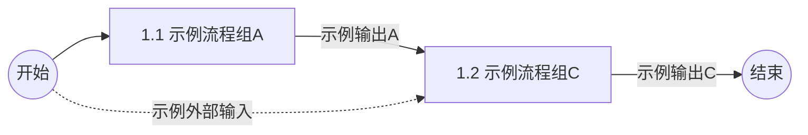
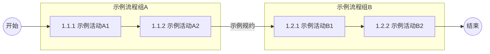
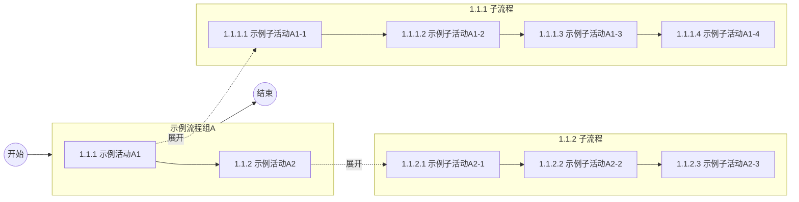

# 业务流程

[返回上一级 · 业务架构目录](../README.md)

本节说明本系统主责业务流程子集及与系统能力的映射，为应用架构设计提供业务输入。

> **业务流程 SSOT**：系统层落地叙事；公司级业务治理框架见 [company/knowledge/business/README.md](../../../company/knowledge/business/README.md)。

## 核心流程

### 业务流程组

<!-- 业务流程组编码段 `a.b` -->

| 编码段 | 业务流程组 | 含义 |
| --- | --- | --- |
| `1.1` | 示例流程组A | 示例：定义元数据与规约，形成系统侧基础配置。 |
| `1.2` | 示例流程组B | 示例：录入与配置，产出进入主链路的规则与对象口径。 |

### 业务流程

<!-- 业务流程编码段：`a.b.c` -->

| 流程编码 | 活动术语 | 含义（业务定义） | 关键输入 | 关键输出 |
| -------- | -------- | --------------------------- | ------------ | ------------ |
| 1.1.1 | `示例活动A1` | 示例：XX。 | XX | XX |
| 1.1.2 | `示例活动A1` | 示例：XX。 | XX | XX |
| 1.2.1 | `示例活动A1` | 示例：XX。 | XX | XX |
| 1.2.2 | `示例活动A1` | 示例：XX。 | XX | XX |

## 分支流程

### 示例子流程A（1.1.x）

本节是 **核心流程 · 业务流程** 中 L3 活动 **`1.1.1`～`1.1.3`** 的 **分支流程（L4）**。

#### 结构关系（L3 与 L4）

| 层级 | 内容 |
| --- | --- |
| L3（上文已定义，本节不修改） | `1.1.1 示例活动A1` → `1.1.2 示例活动A2` 。 |
| L4（本节展开） | 每个 L3 活动下的 `1.1.x.y` 配置项 |

#### 流程说明

**`1.1.1 示例活动A1`（L4 展开）**

| 流程编码 | 活动术语 | 含义（业务定义） | 关键输入 | 关键输出 |
| --- | --- | --- | --- | --- |
| 1.1.1.1 | `示例子活动A1-1` | 示例：XX。 | XX | XX |
| 1.1.1.2 | `示例子活动A1-2` | 示例：XX。 | XX | XX |

**`1.1.2 示例活动A2`（L4 展开）**

| 流程编码 | 活动术语 | 含义（业务定义） | 关键输入 | 关键输出 |
| --- | --- | --- | --- | --- |
| 1.1.2.1 | `示例子活动A2-1` | 示例：XX。 | XX | XX |
| 1.1.2.2 | `示例子活动A2-2` | 示例：XX。 | XX | XX |

能力与 SLA 见 [应用架构 — 服务能力矩阵](../application/chapters/application-architecture.md#服务能力矩阵) 中 `1.2.1`～`1.2.3` 行。

## 异常流程

<!--
应写内容：主路径外的异常、补偿、回滚与升级路径；触发条件、处理 SLA、责任方；与风控、客服的衔接。避免仅写「见运维手册」而无业务条件。
产出建议：异常分支清单或决策表；关键场景附流程片段或状态机说明。
-->

## 系统映射

流程活动与系统能力、接口要点及 SLA 的完整对照见 [应用架构 — 服务能力矩阵](../application/chapters/application-architecture.md#服务能力矩阵)。
